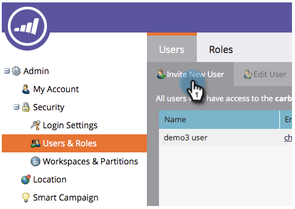

# Crear un usuario solo de API {#create-an-api-only-user}

Si desea integrarlo con Marketo mediante el [API de REST](https://developers.marketo.com/documentation/rest/), deberá crear un usuario solo de API. Así es como.

>[!PREREQUISITES]
>
>[Crear una función de usuario solo de API](/help/marketo/product-docs/administration/users-and-roles/create-an-api-only-user-role.md)

>[!NOTE]
>
>**Se requieren permisos de administrador**

1. En **Administrador**, haga clic en **Usuarios y funciones.**

   

1. Haga clic en **Invitar a nuevo usuario**.

   

1. Introduzca un correo electrónico, nombre y apellidos para el usuario solo de la API. Haga clic en **Siguiente**.

   

   >[!TIP]
   >
   >Agregue un motivo opcional o una fecha de caducidad para acceder. Las fechas de caducidad de acceso son prácticas para los empleados a corto plazo.

1. Seleccione el **Solo API** y compruebe el **Solo API** casilla de verificación. Haga clic en **Siguiente**.

   

1. Haga clic en **Enviar**.

   

>[!NOTE]
>
>La ventana emergente dice: &quot;No se requiere una invitación solo para API&quot;, pero eso no significa que haya hecho algo mal. Solo significa que crearemos la función sin tener que enviar un correo electrónico de invitación.

¡Muy bien entonces! Ahora, sigamos creando el servicio personalizado.

>[!MORELIKETHIS]
>
>[Crear un servicio personalizado para utilizarlo con la API de ReST](/help/marketo/product-docs/administration/additional-integrations/create-a-custom-service-for-use-with-rest-api.md)
