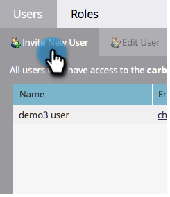

# Crear un usuario solo de API {#create-an-api-only-user}

Si desea integrar con Marketo a través de la [API DE REST](https://developers.marketo.com/documentation/rest/){target="_blank"}, deberá crear un usuario solo de API. Así es como.

>[!IMPORTANT]
>
>Si crea usuarios de solo API en una suscripción que se ha incorporado a Adobe Identity, los pasos son diferentes y [se puede encontrar aquí](/help/marketo/product-docs/administration/marketo-with-adobe-identity/add-api-only-user-for-adobe-ims-enabled-subscriptions.md){target="_blank"}.

>[!PREREQUISITES]
>
>[Crear un rol de usuario solo de API](/help/marketo/product-docs/administration/users-and-roles/create-an-api-only-user-role.md){target="_blank"}

>[!NOTE]
>
>**Permisos de administración necesarios**

1. Vaya a la **[!UICONTROL Administrador]** área.

   

1. Clic **[!UICONTROL Usuarios y funciones]**.

   

1. Clic **[!UICONTROL Invitar nuevo usuario]**.

   

1. Introduzca un correo electrónico, un nombre y un apellido para el usuario solo de API. Clic **[!UICONTROL Siguiente]**.

   

   >[!TIP]
   >
   >Añada un motivo opcional o una fecha de caducidad para el acceso. Las fechas de caducidad del acceso son útiles para los empleados a corto plazo.

1. Seleccione el **[!UICONTROL Solo API]** función y marque la **[!UICONTROL Solo API]** casilla de verificación Clic **[!UICONTROL Siguiente]**.

   

1. Clic **[!UICONTROL Enviar]**.

   

>[!NOTE]
>
>La ventana emergente dice: &quot;No se requiere una invitación solo para la API&quot;, pero eso no significa que haya hecho algo mal. Solo significa que crearemos la función sin tener que enviar un correo electrónico de invitación.

Muy bien, entonces! Ahora sigamos adelante y creemos el servicio personalizado.

>[!MORELIKETHIS]
>
>[Crear un servicio personalizado para utilizarlo con la API de REST](/help/marketo/product-docs/administration/additional-integrations/create-a-custom-service-for-use-with-rest-api.md){target="_blank"}
