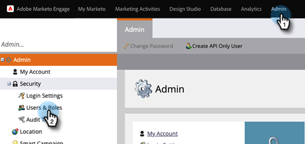
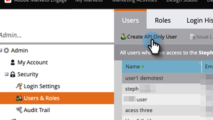
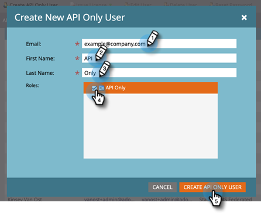

# Añadir usuario solo de API para suscripciones habilitadas para IMS de Adobe {#add-api-only-user-for-adobe-ims-enabled-subscriptions}

Mientras que los usuarios y administradores de Marketo Engage Marketing se administran en Adobe Admin Console, los usuarios solo de la API de Marketo Engage se deben crear y administrar en Marketo Engage.

>[!NOTE]
>
>Solo API Los usuarios creados en la IU de Marketo Engage no cuentan con su asignación de usuarios.

Los pasos siguientes describen cómo agregar un usuario solo de API en Marketo Engage. Antes de hacerlo, debe haber [establecido un Rol solo de API](/help/marketo/product-docs/administration/users-and-roles/create-an-api-only-user-role.md).

1. En Marketo, haga clic en **[!UICONTROL Administrador]** y seleccione **[!UICONTROL Usuarios y roles]**.

   

1. Haga clic en **[!UICONTROL Crear usuario solo de API]**.

   

1. Escriba un [!UICONTROL correo electrónico], [!UICONTROL nombre] y [!UICONTROL apellidos] para el usuario solo de API. Seleccione el rol [!UICONTROL Solo API] que desee asignar al usuario. Haga clic en **[!UICONTROL Crear usuario solo de API]** cuando haya terminado.

   

>[!NOTE]
>
>Cuando la acción se realice correctamente, el modal Crear solo usuario de API se cerrará, la lista de usuarios se actualizará y el nuevo usuario estará visible.
