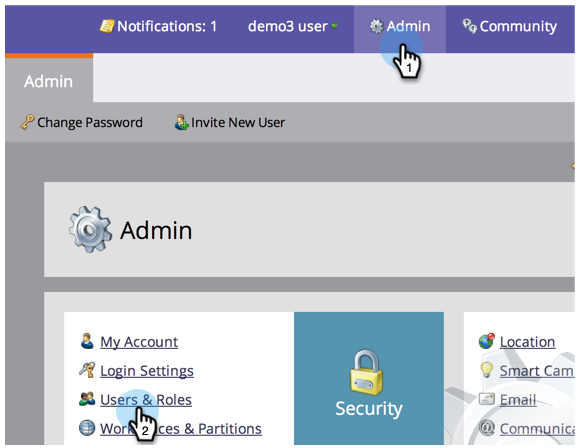

# Crear, eliminar, editar y cambiar una función de usuario {#create-delete-edit-and-change-a-user-role}

**Funciones** agrupa un grupo de permisos. **Permisos** permite hacer cosas en Marketo. Usted asigna un **función** a un usuario. Fácil como pastel.

>[!NOTE]
>
>**Se requieren permisos de administrador**

>[!IMPORTANT]
>
>Las siguientes funciones son funciones del sistema que no se pueden editar ni eliminar:
>
>* Administración
>* Administrador del producto de Adobe
>* Usuario estándar
>* Editor RTP
>* Lanzador RTP

## Crear una función {#create-a-role}

1. Vaya a **Administrador** y haga clic en **Usuarios y funciones**.

   

1. Vaya a la **Ficha Funciones** y haga clic en **Nueva función**.

   

1. Asigne un nombre a la nueva función, compruebe todos los permisos que desee conceder a los usuarios asociados con la función y haga clic en **Crear**.

   

## Eliminar una función {#delete-a-role}

1. En **Administrador**, haga clic en **Usuarios y funciones**.

   

1. En el **Funciones** , seleccione una función y haga clic en **Eliminar función**.

   

1. Confirme la eliminación haciendo clic en **Eliminar**.

   

>[!NOTE]
>
>Primero debe asegurarse de que no se asigne ningún usuario a una función; de lo contrario, no se podrá eliminar.

## Editar una función existente {#edit-an-existing-role}

>[!NOTE]
>
>Para editar su propia función de usuario, deberá iniciar sesión como otro usuario con derechos de administrador.

1. Vaya a **Administrador** y haga clic en **Usuarios y funciones**.

   

1. Haga clic en el **Funciones** pestaña .

   

1. Seleccione la función que desee editar y haga clic en **Editar función**.

   

1. Realice todos los cambios que necesite y haga clic en **Guardar**.

   

   >[!NOTE]
   >
   >Los cambios realizados en la función afectarán a todos los usuarios asociados a esta función.

   >[!TIP]
   >
   >¿Desea actualizar la dirección de correo electrónico de la cuenta? [Aprenda aquí](/help/marketo/product-docs/administration/settings/edit-account-settings.md).

## Cambiar la función de un usuario {#change-a-users-role}

1. Vaya a **Administrador** y haga clic en **Usuarios y funciones**.

   

1. Seleccione el usuario al que desea asignar una función diferente y haga clic en **Editar usuario.**

   

1. Desmarque la función anterior, seleccione la nueva y haga clic en **Guardar**.

   

>[!NOTE]
>
>Si deja varias funciones seleccionadas, Marketo pasará de forma predeterminada al permiso más restrictivo.
