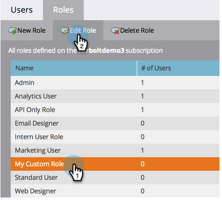

# Crear, eliminar, editar y cambiar una función de usuario {#create-delete-edit-and-change-a-user-role}

**Roles** agrupan un conjunto de permisos. **Permisos** le permiten realizar acciones en Marketo. Usted asigna un **rol** a un usuario.

>[!NOTE]
>
>**Se requieren permisos de administrador**

>[!IMPORTANT]
>
>Las siguientes funciones son funciones del sistema y no se pueden eliminar:
>
>* Administrador
>* Administrador de productos de Adobe

## Crear un rol {#create-a-role}

1. Vaya al área de **[!UICONTROL Admin]**.

   

1. Haga clic en **[!UICONTROL Usuarios y funciones]**.

   

1. Vaya a la ficha **[!UICONTROL Roles]** y haga clic en **[!UICONTROL Nuevo rol]**.

   

1. Asigne un nombre a la nueva función, compruebe todos los permisos que desea conceder a los usuarios asociados con la función y haga clic en **[!UICONTROL Crear]**.

   

## Eliminar un rol {#delete-a-role}

1. Vaya al área de **[!UICONTROL Admin]**.

   

1. Haga clic en **[!UICONTROL Usuarios y funciones]**.

   

1. En la ficha **[!UICONTROL Roles]**, seleccione un rol y haga clic en **[!UICONTROL Eliminar rol]**.

   

1. Confirme la eliminación haciendo clic en **[!UICONTROL Eliminar]**.

   

>[!NOTE]
>
>Primero debe asegurarse de que no hay usuarios asignados a una función; de lo contrario, no se podrá eliminar.

## Editar una función existente {#edit-an-existing-role}

>[!NOTE]
>
>Para editar su propia función de usuario, deberá iniciar sesión como otro usuario con derechos de administrador.

1. Vaya al área de **[!UICONTROL Admin]**.

   

1. Haga clic en **[!UICONTROL Usuarios y funciones]**.

   

1. Haga clic en la ficha **[!UICONTROL Roles]**.

   

1. Seleccione la función que desee editar y haga clic en **[!UICONTROL Editar función]**.

   

1. Realice todos los cambios que necesite y haga clic en **[!UICONTROL Guardar]**.

   

   >[!NOTE]
   >
   >Los cambios realizados en la función afectarán a todos los usuarios asociados a esta función.

## Cambiar rol de usuario {#change-a-users-role}

1. Vaya al área de **[!UICONTROL Admin]**.

   

1. Haga clic en **[!UICONTROL Usuarios y funciones]**.

   

1. Seleccione el usuario al que desee asignar una función diferente y haga clic en **[!UICONTROL Editar usuario]**.

   

1. Desmarque la función anterior, seleccione la nueva y haga clic en **[!UICONTROL Guardar]**.

   

>[!NOTE]
>
>Si deja seleccionados varios roles, Marketo establecerá de forma predeterminada el permiso más restrictivo.
