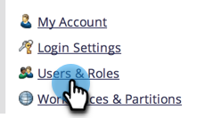
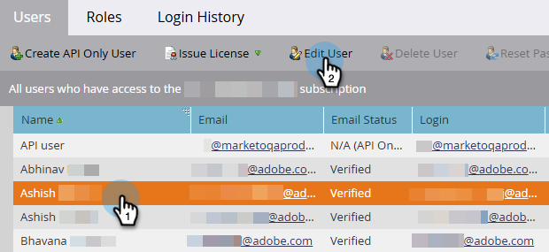

# Editar espacios de trabajo de usuario {#edit-user-workspaces}

1. Vaya al área de **[!UICONTROL Admin]**.

   

1. Haga clic en **[!UICONTROL Usuarios y funciones]**.

   

1. Seleccione el usuario que desee y haga clic en **[!UICONTROL Editar usuario]**.

   

1. Realice los cambios que desee y haga clic en **[!UICONTROL Guardar]**.

   
