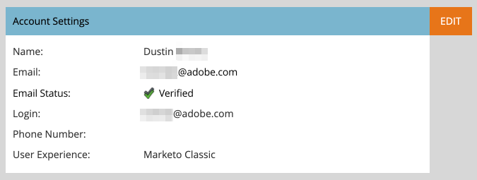

# Verificación de correo electrónico {#email-verification}

Las suscripciones a Adobe Marketo Engage requieren que todos los usuarios que no sean solo de API, incluidos los administradores de Marketo Engage, comprueben su dirección de correo electrónico.

## Por qué se introdujo esta función {#why-this-feature-was-introduced}

El Marketo Engage continúa con la implementación de la verificación por correo electrónico como preparación para migrar clientes a Adobe Business Platform, incluida la migración de usuarios a ID de Adobe. Esta función mejora la seguridad de las cuentas de usuario de Marketo Engage existentes. Para garantizar que un usuario Marketo Engage esté asociado con el Adobe ID adecuado, los usuarios Marketo Engage existentes deben comprobar su dirección de correo electrónico. Un usuario Marketo Engage debe tener una dirección de correo electrónico verificada para poder migrar a un Adobe ID. Si un usuario Marketo Engage no comprueba su dirección de correo electrónico, no puede migrarse a una Adobe ID y perderá el acceso a una suscripción de Marketo una vez completada la migración de usuario para la suscripción.

## Invitación de usuario {#user-invite}

Cuando un administrador invita a un usuario, este se verifica automáticamente una vez que hace clic en el vínculo de invitación.

## Correo electrónico de verificación {#verification-email}

Los usuarios recibirán el siguiente correo electrónico cuando se active la verificación por correo electrónico para una suscripción o si la activa un administrador/usuario:

>[!NOTE]
>
>Para reenviar un correo electrónico de verificación a un usuario no verificado, simplemente seleccione su registro y haga clic en **[!UICONTROL Verificar correo electrónico]** botón.

## Cambio de una dirección de correo electrónico {#changing-an-email-address}

Cuando se cambia la dirección de correo electrónico de un usuario, pasa a estar sin verificar. Se les enviará un correo electrónico para que puedan volver a verificarlo. Los usuarios pueden reenviar manualmente ese correo electrónico haciendo clic en **[!UICONTROL Reenviar verificación]**.

## Usuarios y funciones {#users-and-roles}

Entrada **[!UICONTROL Administrador]** > **[!UICONTROL Usuarios y funciones]**, la columna Estado de correo electrónico muestra el estado de verificación de cada usuario.

## ID de inicio de sesión de varios usuarios {#multiple-user-login-ids}

Solo se puede asociar una cuenta de usuario a una sola dirección de correo electrónico. Si hay varias cuentas de usuario asociadas a una sola dirección de correo electrónico, Marketo Engage requiere que se resuelva el conflicto y se muestren todos los inicios de sesión de usuario asociados a la dirección de correo electrónico, así como tres opciones de resolución:

* Usar el correo electrónico actual para el ID de inicio de sesión del usuario actual
* Usar un nuevo correo electrónico para el ID de inicio de sesión del usuario actual
* Retrasar la decisión hasta el siguiente inicio de sesión

  

>[!NOTE]
>
>Aunque una cuenta de usuario debe asociarse con una sola dirección, se puede utilizar una cuenta de usuario en muchas suscripciones mediante un ID universal.
