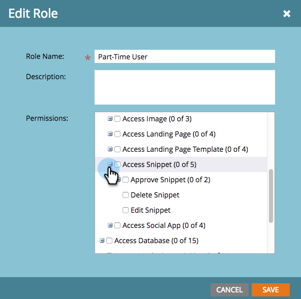

# Habilitar la opción Sin borrador para fragmentos {#enable-no-draft-for-snippets}

La opción Sin borrador para fragmentos permite distribuir cambios en los fragmentos de código sin necesidad de crear recursos aprobados para utilizarla. Todos los recursos que utilizan el fragmento editado obtienen las actualizaciones y mantienen sus respectivos estados:

* Los recursos aprobados obtienen las actualizaciones de fragmento y permanecen aprobados

* Los borradores obtienen las actualizaciones de fragmentos y permanecen en modo de borrador

La opción No borrador se habilita automáticamente para todas las funciones de administrador. Un administrador puede habilitar esta función para cualquier función adicional.

>[!NOTE]
>
>**Permisos de administración necesarios**

1. Vaya a la **Administrador** área.

   

1. Clic **Usuarios y funciones**.

   

1. Vaya a la **Funciones** , seleccione una función y haga clic en **Editar rol**.

   

1. Expanda el **Acceder a Design Studio** opción.

   

1. Expanda el **Fragmento de acceso** opción.

   

1. Expanda el **Aprobar fragmento** y compruebe el **Sin Borrador** cuadro. Luego haga clic en **Guardar**.

   

>[!TIP]
>
>Para desactivar la opción Sin borrador, siga los pasos del 1 al 4 anteriores, desactive la casilla No borrador y haga clic en **Guardar**.

>[!MORELIKETHIS]
>
>[Aprobar un fragmento sin borrador](/help/marketo/product-docs/personalization/segmentation-and-snippets/snippets/approve-a-snippet-with-no-draft.md)
