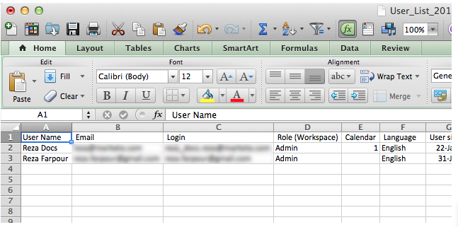

# Exportar una lista de usuarios y funciones {#export-a-list-of-users-and-roles}

>[!NOTE]
>
>**Se requieren permisos de administrador**

Es bastante fácil exportar una lista completa de los usuarios y las funciones de usuario. Así es como.

1. Vaya a **Admin**.

   

1. Haga clic en **Usuarios y funciones**.

   

1. Agregue o elimine las columnas que desee antes de exportar.

   >[!TIP]
   >
   >Para exportar funciones, vaya a la pestaña **Roles**** **primero y luego exporte.

   

1. Haga clic en el icono **Export**.

   

   ¡Y eso es todo amigos! Debe descargar el nuevo archivo de Excel.

   
