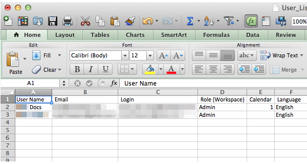

# Exportación de una lista de usuarios y funciones {#export-a-list-of-users-and-roles}

>[!NOTE]
>
>**Se requieren permisos de administrador**

Siga los pasos a continuación para exportar una lista completa de usuarios y funciones de usuario.

1. Ir a **[!UICONTROL Administrador]**.

   

1. Haga clic en **[!UICONTROL Usuarios y funciones]**.

   

1. Añada o quite las columnas que desee antes de exportarlas.

   >[!TIP]
   >
   >Para exportar los roles, vaya primero a la ficha **[!UICONTROL Roles]** y, a continuación, exporte.

   

1. Haga clic en el icono **[!UICONTROL Exportar]**.

   

   El archivo de Excel comienza a descargarse.

   
