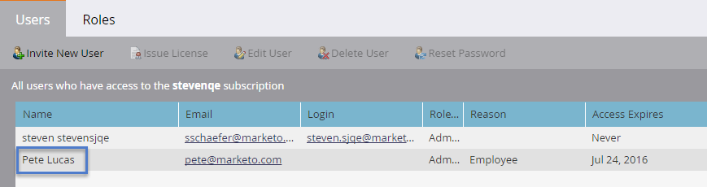

# Administración de usuarios de mercadotecnia {#managing-marketo-users}

## Crear usuarios {#create-users}

1. Vaya a **Administración** y haga clic en **Usuarios y roles**.

   

1. Haga clic en **Invitar a nuevo usuario**.

   

1. Introduzca la **dirección de correo electrónico**, **Nombre** y **Apellidos**.

   

1. De forma opcional, introduzca un motivo para la invitación y seleccione una fecha de caducidad en el campo **El acceso caduca** mediante el selector de fechas.

   

1. Haga clic en **Siguiente**.

   

   >[!TIP]
   >
   >Una fecha de caducidad es buena para los consultores o interesados externos a corto plazo que necesitan acceso a Marketing sólo por un breve tiempo.

   >[!NOTE]
   >
   >Cuando llega la fecha de caducidad, el usuario recibe una notificación de caducidad y su cuenta está bloqueada.

1. Seleccione la **función** de su elección y haga clic en **Siguiente**.

   

1. Edite el mensaje de invitación si es necesario. Haga clic en **Enviar**.

   

   >[!NOTE]
   >
   >El correo electrónico o el inicio de sesión deben ser únicos; si ya lo ha utilizado en una instancia de simulación de pruebas, deberá utilizar otra en producción y viceversa.

   

   >[!NOTE]
   >
   >Las invitaciones caducan tres días después de agregar un nuevo usuario.

El nuevo usuario aparece ahora en la ficha Usuarios y recibirá un correo electrónico con instrucciones sobre cómo activar su cuenta.

## Eliminar usuarios {#delete-users}

1. Vaya a Administración y haga clic en **Usuarios y roles**.

   

1. Seleccione el usuario que desee eliminar y haga clic en **Eliminar usuario**.

   

1. Confirme haciendo clic en **Aceptar**.

   

## Restablecer contraseñas de usuario {#reset-user-passwords}

1. Vaya a Administración y haga clic en **Usuarios y roles**.

   

1. Seleccione un usuario y haga clic en **Restablecer contraseña**.

   

1. Haga clic en **Cerrar** para descartar el mensaje.

   

El usuario recibirá un mensaje de correo electrónico con instrucciones de restablecimiento de contraseña.

>[!TIP]
>
>Si el usuario no ve el correo electrónico en su bandeja de entrada, pídale que compruebe su carpeta de correo no deseado.

## Cambiar permisos y editar información de usuario {#change-permissions-and-edit-user-information}

1. Vaya a **Administración** y haga clic en **Usuarios y roles.**

   

1. Seleccione un usuario y haga clic en **Editar usuario**.

   

1. Puede editar la información del usuario y cambiar la función asociada. Haga clic en **Guardar**.

   

>[!CAUTION]
>
>Si es el único administrador de Marketing, asegúrese de no eliminar sus propios derechos de administrador.

>[!NOTE]
>
>Si se invita a un nuevo usuario como administrador o si se elimina un administrador, todos los administradores actuales recibirán una notificación por correo electrónico.

¡Increíble trabajo! Ahora sabe cómo crear un usuario, eliminarlo, restablecerlo y editarlo.
