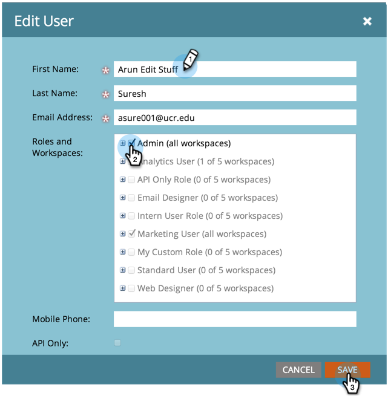

# Administración de usuarios de Marketo {#managing-marketo-users}

>[!IMPORTANT]
>
>Este artículo es solo para aquellos que _no_ usan [Marketo con Adobe Identity](/help/marketo/product-docs/administration/marketo-with-adobe-identity/adobe-identity-management-overview.md){target="_blank"}. Si lo hace, siga los pasos de [este artículo](/help/marketo/product-docs/administration/marketo-with-adobe-identity/add-or-remove-a-user.md){target="_blank"}.

## Crear usuarios {#create-users}

1. Vaya al área de **[!UICONTROL Admin]**.

   

1. Haga clic en **[!UICONTROL Usuarios y funciones]**.

   

1. Haga clic en **[!UICONTROL Invitar nuevo usuario]**.

   

1. Escriba **[!UICONTROL Correo electrónico]**, **[!UICONTROL Nombre]** y **[!UICONTROL Apellidos]**.

   

1. De manera opcional, escriba un motivo para la invitación y seleccione una fecha de caducidad en el campo **[!UICONTROL Caduca el acceso]** con el selector de fechas.

   

1. Haga clic en **[!UICONTROL Siguiente]**.

   

   >[!TIP]
   >
   >Una fecha de caducidad es ideal para partes interesadas externas o consultores a corto plazo que solo necesitan acceso a Marketo durante un breve periodo de tiempo.

   >[!NOTE]
   >
   >Cuando llega la fecha de caducidad, el usuario recibe una notificación de caducidad y su cuenta se bloquea.

1. Seleccione el **[!UICONTROL Rol]** que elija y haga clic en **[!UICONTROL Siguiente]**.

   

1. Edite el mensaje de invitación si es necesario. Haga clic en **Send**.

   

   >[!NOTE]
   >
   >El correo electrónico/inicio de sesión debe ser único; si ya lo ha utilizado en una instancia de zona protegida, deberá utilizar una diferente en producción y viceversa.

   

   >[!NOTE]
   >
   >Las invitaciones caducan tres días después de que se agregue un nuevo usuario.

El nuevo usuario ahora aparece en la pestaña Usuarios y recibirá un correo electrónico con instrucciones sobre cómo activar su cuenta.

## Eliminar usuarios {#delete-users}

>[!NOTE]
>
>Si el usuario que deseas eliminar también es un usuario de Dynamic Chat, debes [eliminarlo de Dynamic Chat](/help/marketo/product-docs/demand-generation/dynamic-chat/setup-and-configuration/add-or-remove-chat-users.md#remove-a-chat-user){target="_blank"} en Admin Console para poder eliminarlo en Marketo Engage.

1. Vaya al área de **[!UICONTROL Admin]**.

   

1. Haga clic en **[!UICONTROL Usuarios y funciones]**.

   

1. Seleccione el usuario que desee eliminar y haga clic en **[!UICONTROL Eliminar usuario]**.

   

1. Confirme haciendo clic en **[!UICONTROL Aceptar]**.

   

## Restablecer contraseñas de usuario {#reset-user-passwords}

1. Vaya al área de **[!UICONTROL Admin]**.

   

1. Haga clic en **[!UICONTROL Usuarios y funciones]**.

   

1. Seleccione un usuario y haga clic en **[!UICONTROL Restablecer contraseña]**.

   

1. Haga clic en **[!UICONTROL Cerrar]** para cerrar la solicitud.

   

El usuario recibirá un correo electrónico con las instrucciones para restablecer la contraseña.

>[!TIP]
>
>Si el usuario no ve el correo electrónico en su bandeja de entrada, pídale que compruebe su carpeta de correo no deseado.

## Cambiar permisos y editar información de usuario {#change-permissions-and-edit-user-information}

1. Vaya al área de **[!UICONTROL Admin]**.

   

1. Haga clic en **[!UICONTROL Usuarios y funciones]**.

   

1. Seleccione un usuario y haga clic en **[!UICONTROL Editar usuario]**.

   

1. Puede editar la información del usuario y cambiar la función asociada. Haga clic en **[!UICONTROL Guardar]**.

   

>[!CAUTION]
>
>Si es el único administrador en Marketo, asegúrese de no eliminar sus propios derechos de administrador.

>[!NOTE]
>
>Si se invita a un nuevo usuario como administrador, o si se elimina un administrador, todos los administradores actuales recibirán una notificación por correo electrónico.

¡Increíble trabajo! Ahora sabe cómo crear un usuario, eliminarlo, restablecer la contraseña de un usuario y editar usuarios.
