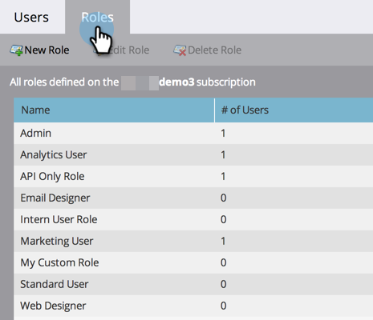

# Administración de roles y permisos de usuario {#managing-user-roles-and-permissions}

Establezca, cree y edite funciones de usuario y asígnelas a usuarios. Esto le permite controlar las áreas y la funcionalidad a las que cada usuario de Marketo tiene acceso.

Por ejemplo: un usuario de marketing suele necesitar un acceso amplio en toda la aplicación para crear, modificar e implementar correos electrónicos, páginas de aterrizaje y programas. Un diseñador web, por otro lado, pasa casi todo su tiempo en el Design Studio, creando recursos para usarlos en correos electrónicos y páginas de aterrizaje. Y aunque los líderes de la compañía hacen un uso extensivo de los informes de Marketo en el área de Analytics, es posible que no necesiten crear ni dirigir los recursos o programas ellos mismos.

>[!NOTE]
>
>**Permisos de administración necesarios**

Marketo proporciona varias funciones integradas, con diferentes niveles de acceso:

* **Administrador** - todas las partes de la aplicación, incluida la sección Admin
* **Usuario estándar** - todas las partes de la aplicación, excepto la sección Admin
* **Usuario de marketing** - todas las partes de la aplicación, excepto la sección Admin
* **Diseñador web** - sólo el Design Studio
* **Usuario de Analytics** - solo la sección Analytics

No puede editar las funciones Administrador y Usuario estándar, pero puede editar las demás. También puede crear nuevas funciones personalizadas para que coincidan con las estructuras organizativas particulares de su compañía.

## Marketo con identidad de Adobe {#marketo-with-adobe-identity}

Si utiliza Marketo con identidad de Adobe, consulte la lista de descripciones de perfiles [se puede encontrar aquí](/help/marketo/product-docs/administration/marketo-with-adobe-identity/adobe-identity-management-overview.md#profile-levels).

## Asignar funciones a un usuario {#assign-roles-to-a-user}

Puede asignar funciones a un usuario cuando [creación de usuarios por primera vez](/help/marketo/product-docs/administration/users-and-roles/create-delete-edit-and-change-a-user-role.md) o por [edición de un usuario existente](/help/marketo/product-docs/administration/users-and-roles/managing-marketo-users.md).

1. Vaya a la **[!UICONTROL Administrador]** área.

   

1. Clic **[!UICONTROL Usuarios y funciones]**.

   

1. En la lista, seleccione el usuario que desea editar y haga clic en **[!UICONTROL Editar usuario]**.

   

1. En **[!UICONTROL Funciones]**, seleccione las funciones que desee asignar al usuario según los permisos que necesite y haga clic en **[!UICONTROL Guardar]**.

   

   >[!NOTE]
   >
   >Para obtener más información sobre cada función, consulte [Descripciones de los permisos de funciones](/help/marketo/product-docs/administration/users-and-roles/descriptions-of-role-permissions.md).

## Crear una función nueva {#create-a-new-role}

A veces, su organización tiene empleados con funciones muy específicas que requieren una combinación personalizada de permisos.

1. Vaya a la **[!UICONTROL Administrador]** área.

   

1. Clic **[!UICONTROL Usuarios y funciones]**.

   

1. Haga clic en **[!UICONTROL Funciones]** pestaña.

   

1. Clic **[!UICONTROL Nuevo rol]**.

   

1. Introduzca una **[!UICONTROL Nombre de rol]**, a **[!UICONTROL Descripción]** (opcional) y seleccione los permisos que necesitarán los usuarios de esta función.

   

## Editar un rol {#edit-a-role}

Si necesita cambiar los permisos asociados a una función existente, puede editar la función.

1. Vaya a la **[!UICONTROL Administrador]** área.

   

1. Clic **[!UICONTROL Usuarios y funciones]**.

   

1. Haga clic en **[!UICONTROL Funciones]** pestaña.

   

1. En la lista, seleccione el rol que desea modificar y haga clic en **[!UICONTROL Editar rol]**.

   

1. Cambie el **[!UICONTROL Nombre de rol]** y **[!UICONTROL Descripción]** si es necesario, y cambie la selección de asociado **[!UICONTROL Permisos]**.

   

   >[!NOTE]
   >
   >Los usuarios que tengan la función que ha editado recibirán los permisos modificados después de cerrar la sesión y volver a iniciarla.

## Eliminar un rol {#delete-a-role}

Si una función se vuelve innecesaria, puede eliminarla.

1. Vaya a la **[!UICONTROL Administrador]** área.

   

1. Clic **[!UICONTROL Usuarios y funciones]**.

   

1. Haga clic en **[!UICONTROL Funciones]** pestaña.

   

1. En la lista, seleccione la función que desee eliminar y haga clic en **[!UICONTROL Eliminar función]**.

   

1. Clic **[!UICONTROL Eliminar]** para confirmar.

   
