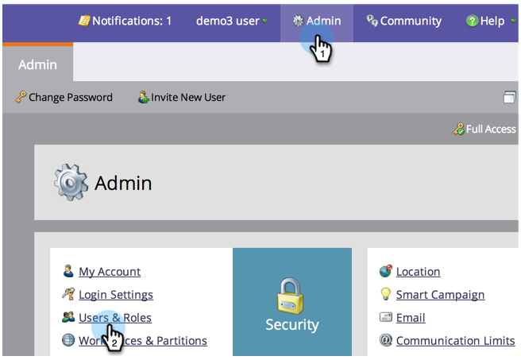

# Administración de roles y permisos de usuario {#managing-user-roles-and-permissions}

Defina, cree y edite las funciones de usuario y asígnelas a los usuarios. Esto le permite controlar las áreas y la funcionalidad a las que cada usuario de Marketo tiene acceso.

Por ejemplo, un usuario de marketing suele necesitar un acceso amplio en toda la aplicación para crear, modificar e implementar correos electrónicos, páginas de aterrizaje y programas. Un diseñador web, por otro lado, pasa casi todo su tiempo en Design Studio, creando recursos para usarlos en correos electrónicos y páginas de aterrizaje. Y aunque los líderes de las empresas hacen un uso extensivo de los informes de Marketo en el área de Analytics, es posible que no tengan que crear o dirigir los recursos o programas ellos mismos.

>[!NOTE]
>
>**Se requieren permisos de administrador**

Marketo proporciona varias funciones integradas, con diferentes niveles de acceso:

* **Administrador** : todas las partes de la aplicación, incluida la sección Administración
* **Usuario estándar** - todas las partes de la aplicación, excepto la sección Administración
* **Usuario de marketing** - todas las partes de la aplicación, excepto la sección Administración
* **Diseñador web** - sólo Design Studio
* **Usuario de Analytics** : solo la sección Analytics

No puede editar las funciones de administrador y usuario estándar, pero sí las demás. También puede crear nuevas funciones personalizadas para que coincidan con las estructuras organizativas específicas de su empresa.

## Marketo con identidad de Adobe {#marketo-with-adobe-identity}

Si utiliza Marketo con identidad de Adobe, la lista de descripciones de perfil [se puede encontrar aquí](/help/marketo/product-docs/administration/marketo-with-adobe-identity/overview.md#profile-levels).

## Asignar funciones a un usuario {#assign-roles-to-a-user}

Puede asignar funciones a un usuario cuando [crear usuarios por primera vez](/help/marketo/product-docs/administration/users-and-roles/create-delete-edit-and-change-a-user-role.md) o [editar un usuario existente](/help/marketo/product-docs/administration/users-and-roles/managing-marketo-users.md).

1. Para editar un usuario existente, vaya a **Administrador** y haga clic en **Usuarios y funciones**.

   

1. En la lista, seleccione el usuario que desee editar y haga clic en **Editar usuario**.

   

1. En **Funciones**, seleccione las funciones que desee asignar al usuario según los permisos que necesite y haga clic en **Guardar**.

   

   >[!NOTE]
   >
   >Para obtener más información sobre cada función, consulte  [Descripciones de los permisos de funciones](/help/marketo/product-docs/administration/users-and-roles/managing-user-roles-and-permissions/descriptions-of-role-permissions.md).

## Crear una función nueva {#create-a-new-role}

A veces, su organización tiene empleados con funciones muy específicas que requieren una combinación personalizada de permisos.

1. Para crear una función de usuario nueva, vaya a Administración y haga clic en **Usuarios y funciones**.

   

1. Haga clic en el **Funciones** pestaña .

   

1. Haga clic en **Nueva función**.

   

1. Escriba un **Nombre del rol**, **Descripción** (opcional) y seleccione los permisos que necesitarán los usuarios con esta función.

   

## Editar una función {#edit-a-role}

Si necesita cambiar los permisos asociados a una función existente, puede editar la función.

1. Vaya a **Administrador** y haga clic en **Usuarios y funciones**.

   

1. Haga clic en el **Funciones** pestaña .

   

1. En la lista, seleccione la función que desee modificar y haga clic en **Editar función**.

   

1. Cambie el **Nombre del rol** y **Descripción** si es necesario, cambie la selección de **Permisos**.

   

   >[!NOTE]
   >
   >Los usuarios que tengan la función que ha editado recibirán los permisos modificados después de cerrar la sesión y volver a iniciarla.

## Eliminar una función {#delete-a-role}

Si una función se vuelve innecesaria, puede eliminarla.

1. Vaya a Administración y haga clic en **Usuarios y funciones**.

   

1. Haga clic en el **Funciones** pestaña .

   

1. En la lista, seleccione la función que desee eliminar y haga clic en **Eliminar función**.

   

1. Haga clic en **Eliminar** para confirmar.

   
