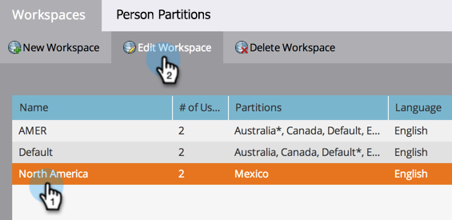

# Asignar particiones de persona a espacios de trabajo {#assign-person-partitions-to-workspaces}

Siga los pasos a continuación para editar las asignaciones de partición de persona y espacio de trabajo:

>[!NOTE]
>
>**Se requieren permisos de administrador**

>[!PREREQUISITES]
>
>[Crear un nuevo Workspace](/help/marketo/product-docs/administration/workspaces-and-person-partitions/create-a-new-workspace.md){target="_blank"}

>[!CAUTION]
>
>Los espacios de trabajo y las particiones de persona pueden ser complejos. Póngase en contacto con el [soporte técnico de Marketo](https://nation.marketo.com/t5/Support/ct-p/Support){target="_blank"} para obtener ayuda con la configuración.

1. Vaya al área de **[!UICONTROL Admin]**.

   

1. Haga clic en **[!UICONTROL Espacios de trabajo y particiones]**.

   

1. Seleccione su área de trabajo y haga clic en **[!UICONTROL Editar Workspace]**.

   

1. Edite la información de partición de persona que desee cambiar.

   

   >[!NOTE]
   >
   >* La casilla de verificación &quot;[!UICONTROL Todas las particiones de persona]&quot; indica que este espacio de trabajo tiene acceso a todas las particiones de persona del sistema.
   >
   >* Las particiones de persona principales son las predeterminadas en las que se escribirán todas las personas. Use [pasos de flujo](/help/marketo/product-docs/core-marketo-concepts/smart-campaigns/flow-actions/use-add-choice-in-a-flow-step.md) o [reglas de asignación](/help/marketo/product-docs/administration/workspaces-and-person-partitions/assigning-person-partitions-with-assignment-rules.md){target="_blank"} para mover personas entre particiones.

1. Haga clic en **[!UICONTROL Guardar]**.

   

Después de guardar, debería ver los cambios.

>[!MORELIKETHIS]
>
>[Explicación de espacios de trabajo y particiones de persona](/help/marketo/product-docs/administration/workspaces-and-person-partitions/understanding-workspaces-and-person-partitions.md){target="_blank"}.
