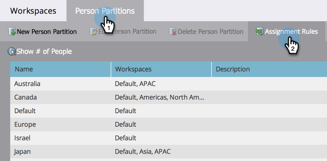

# Asignación de particiones de personas con reglas de asignación {#assigning-person-partitions-with-assignment-rules}

>[!NOTE]
>
>**Se requieren permisos de administrador**

>[!PREREQUISITES]
>
>[Crear una partición de persona](/help/marketo/product-docs/administration/workspaces-and-person-partitions/create-a-person-partition.md)

Cuando utilice particiones de persona, configure reglas de asignación para enrutar a las personas creadas desde su CRM a sus particiones respectivas.

>[!NOTE]
>
>Solo las personas creadas en Marketo desde su CRM y mediante la API de SOAP tendrán reglas de asignación aplicadas.

1. Vaya al área de **[!UICONTROL Admin]**.

   

1. Haga clic en **[!UICONTROL Espacios de trabajo y particiones]**.

   

1. En la ficha **[!UICONTROL Particiones de persona]**, haga clic en **[!UICONTROL Reglas de asignación]**.

   

1. Haga clic en **[!UICONTROL Agregar opción]** para agregar condiciones para enrutar personas a particiones de persona.

   

1. Seleccione el campo en el que se debe crear la condición.

   

1. Seleccione el operador de opción e introduzca un valor.

   

1. Seleccione la partición de personas en la que desea que caigan las personas que cumplan las condiciones.

   

   >[!NOTE]
   >
   >Puede agregar tantas opciones como desee.

1. Haga clic en **[!UICONTROL Guardar]**.

   

Se han configurado las reglas de asignación para las particiones de persona.

>[!NOTE]
>
>La opción predeterminada se aplica si no se cumple ninguna de las condiciones anteriores.
