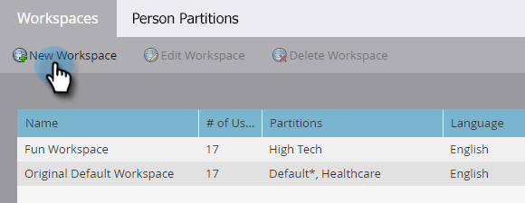
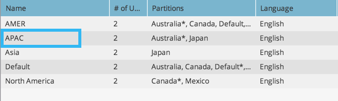

# Creación de un nuevo espacio de trabajo {#create-a-new-workspace}

Los espacios de trabajo son útiles para subdividir la compañía. Los motivos para configurar espacios de trabajo son:

* Geografía: operaciones de marketing en Europa frente a operaciones de marketing en Norteamérica
* Unidad de negocio A vs. Unidad de negocio B

A continuación se indica cómo crear un nuevo espacio de trabajo.

>[!NOTE]
>
>**Se requieren permisos de administración**

>[!NOTE]
>
>Comprender primero con [Explicación de los espacios de trabajo y las particiones de persona](/help/marketo/product-docs/administration/workspaces-and-person-partitions/understanding-workspaces-and-person-partitions.md){target="_blank"}.

>[!TIP]
>
>Para obtener más información acerca de las prácticas recomendadas de Workspace, comuníquese con [Marketo Professional Services](https://business.adobe.com/products/marketo/services-support.html){target="_blank"}.

1. Vaya al área de **[!UICONTROL Admin]**.

   

1. Haga clic en **[!UICONTROL Espacios de trabajo y particiones]**.

   

1. Haga clic en **[!UICONTROL Nuevo Workspace]**.

   

1. Escriba un **[!UICONTROL Nombre]** y seleccione las **[!UICONTROL Particiones de persona]** que desee usar. Elija una **[!UICONTROL Partición de persona principal]**. Asegúrese de [crear particiones de persona](/help/marketo/product-docs/administration/workspaces-and-person-partitions/create-a-person-partition.md){target="_blank"} si aún no lo ha hecho.

   

   >[!NOTE]
   >
   >* La casilla de verificación **[!UICONTROL Todas las particiones de persona]** significa que este espacio de trabajo puede usar todas las particiones de persona del sistema.
   >
   >* La **[!UICONTROL Partición de persona principal]** actúa como predeterminada y es donde se asignarán todas las personas.

   >[!IMPORTANT]
   >
   >Si ha habilitado varios dominios con marca, debe elegir un dominio con marca principal.

1. Seleccione el idioma de Workspace.

   

   >[!NOTE]
   >
   >Una vez creado, Marketo iniciará los recursos de muestra en el espacio de trabajo. El idioma permite que esos objetos sembrados estén en un idioma que no sea el inglés.

1. Haga clic en **[!UICONTROL Crear]**.

   

Cree tantos espacios de trabajo como necesite y asígneles las particiones de persona adecuadas.

Después de crear el espacio de trabajo, debería ver la actualización.

