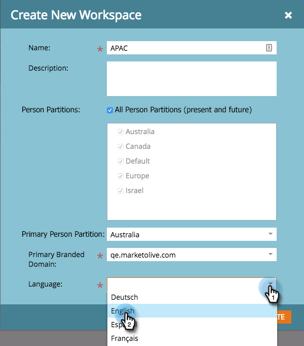

# Crear un nuevo espacio de trabajo {#create-a-new-workspace}

Los espacios de trabajo son útiles para la subdivisión de la empresa. Entre los motivos para configurar espacios de trabajo se incluyen:

* Geografía: Operaciones de marketing de Europa frente a operaciones de marketing de Norteamérica
* Unidad de negocio A frente a unidad de negocio B

A continuación se explica cómo crear un nuevo espacio de trabajo.

>[!NOTE]
>
>**Se requieren permisos de administrador**

>[!NOTE]
>
>Comprender primero con [Explicación de los espacios de trabajo y las particiones de persona](/help/marketo/product-docs/administration/workspaces-and-person-partitions/understanding-workspaces-and-person-partitions.md).

>[!NOTE]
>
>Para obtener más información sobre las prácticas recomendadas de Workspace, póngase en contacto con [Marketo Professional Services](mailto:services@marketo.com).

1. En **Administración**, haga clic en **Espacios de trabajo y particiones**.

   

1. Haga clic en **Nuevo espacio de trabajo**.

   

1. Introduzca un **Name** y seleccione las **Particiones de personas** que desee utilizar. Elija una **Partición de persona principal**.

   >[!NOTE]
   >
   >Asegúrese de [crear particiones de persona](/help/marketo/product-docs/administration/workspaces-and-person-partitions/create-a-person-partition.md) si aún no lo ha hecho.

   

   >[!NOTE]
   >
   >La casilla de verificación **Todas las particiones de persona** significa que este espacio de trabajo puede utilizar todas las particiones de persona del sistema.
   >
   >La **partición de persona principal** actúa como predeterminada y es donde se asignarán todas las personas.

   Si ha habilitado varios dominios con marca, debe elegir un dominio con marca principal.

   

1. Seleccione el idioma del espacio de trabajo.

   >[!NOTE]
   >
   >Tras la creación, Marketo sembrará recursos de ejemplo en el espacio de trabajo. El lenguaje permite que esos objetos predefinidos estén en un idioma que no sea el inglés.

   

1. Haga clic en **Crear**.

   

   Cree tantos espacios de trabajo como necesite y asígneles las particiones de persona adecuadas.

   Después de crear el espacio de trabajo, debería ver la actualización.

   
