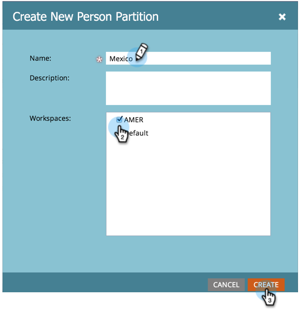

# Crear una partición de persona {#create-a-person-partition}

Cree una nueva partición de persona siguiendo estos pasos.

>[!NOTE]
>
>**Permisos de administración necesarios**

>[!NOTE]
>
>Comprender primero con [Explicación de espacios de trabajo y particiones de persona](/help/marketo/product-docs/administration/workspaces-and-person-partitions/understanding-workspaces-and-person-partitions.md).

1. Vaya a la **[!UICONTROL Administrador]** área.

   

1. Clic **[!UICONTROL Espacios de trabajo y particiones]**.

   

1. Vaya a la **[!UICONTROL Particiones de persona]** y haga clic en **[!UICONTROL Nueva partición de persona]**.

   

1. Asigne un nombre a la partición y elija **[!UICONTROL Workspaces]** donde aparecerá y haga clic en **[!UICONTROL Crear]**.

   

Después de crear la partición, debería ver la actualización.

