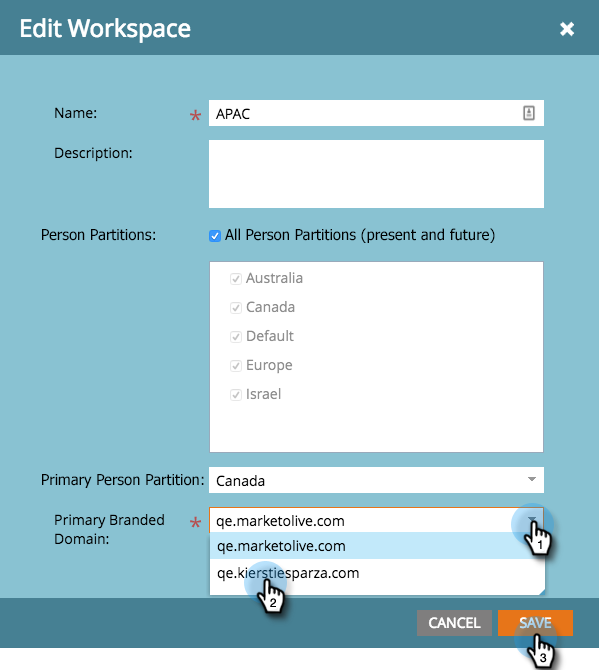

# Editar un espacio de trabajo {#edit-a-workspace}

A veces debe realizar cambios en un espacio de trabajo. Es fácil.

>[!NOTE]
>
>**Se requieren permisos de administrador**

>[!NOTE]
>
>Pincel sobre espacios de trabajo con [Explicación de espacios de trabajo y particiones de persona](/help/marketo/product-docs/administration/workspaces-and-person-partitions/understanding-workspaces-and-person-partitions.md).

1. En **Administración**, haga clic en **Espacios de trabajo y particiones**.

   

1. Seleccione el espacio de trabajo que desea editar y haga clic en **Editar espacio de trabajo**.

   

1. Puede seleccionar una partición de posible cliente diferente y elegir otra partición de persona principal en la lista desplegable.

   >[!NOTE]
   >
   >Puede [crear más particiones de persona](/help/marketo/product-docs/administration/workspaces-and-person-partitions/create-a-person-partition.md) si las necesita.

   

   >[!NOTE]
   >
   >La casilla de verificación **Todas las particiones de persona** significa que este espacio de trabajo puede utilizar todas las particiones de posible cliente del sistema.

   >[!NOTE]
   >
   >La **partición de persona principal** actúa como predeterminada y es donde se asignarán todas las personas.

   Si ha habilitado varios dominios con marca, puede cambiar a otro dominio con marca principal. Haga clic en **Guardar**.

   

   >[!NOTE]
   >
   >No se puede cambiar el idioma del espacio de trabajo.

>[!MORELIKETHIS]
>
>* [Crear un nuevo espacio de trabajo](/help/marketo/product-docs/administration/workspaces-and-person-partitions/create-a-new-workspace.md)
>* [Explicación de los espacios de trabajo y las particiones de persona](/help/marketo/product-docs/administration/workspaces-and-person-partitions/understanding-workspaces-and-person-partitions.md)

