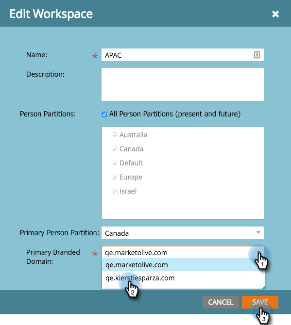

# Edición de un espacio de trabajo {#edit-a-workspace}

A veces, debe realizar cambios en un Workspace.

>[!NOTE]
>
>**Se requieren permisos de administrador**

>[!NOTE]
>
>Para obtener más información sobre los espacios de trabajo, vea [Explicación de los espacios de trabajo y las particiones de persona](/help/marketo/product-docs/administration/workspaces-and-person-partitions/understanding-workspaces-and-person-partitions.md){target="_blank"}.

1. Vaya al área de **[!UICONTROL Admin]**.

   

1. Haga clic en **[!UICONTROL Espacios de trabajo y particiones]**.

   

1. Seleccione el área de trabajo que desea editar y haga clic en **[!UICONTROL Editar Workspace]**.

   

1. Puede seleccionar una partición de posible cliente diferente y elegir una partición de persona principal diferente en la lista desplegable.

   >[!NOTE]
   >
   >Puede [crear más particiones de persona](/help/marketo/product-docs/administration/workspaces-and-person-partitions/create-a-person-partition.md){target="_blank"} si las necesita.

   

   >[!NOTE]
   >
   >La casilla de verificación **[!UICONTROL Todas las particiones de persona]** significa que este espacio de trabajo puede utilizar todas las particiones de posibles clientes del sistema.

   >[!NOTE]
   >
   >La **[!UICONTROL Partición de persona principal]** actúa como predeterminada y es donde se asignarán todas las personas.

   Si ha habilitado varios dominios con marca, puede cambiar a un dominio con marca principal diferente. Haga clic en **[!UICONTROL Guardar]**.

   

   >[!NOTE]
   >
   >El idioma del espacio de trabajo no se puede cambiar.

>[!MORELIKETHIS]
>
>* [Crear un nuevo Workspace](/help/marketo/product-docs/administration/workspaces-and-person-partitions/create-a-new-workspace.md){target="_blank"}
>* [Explicación de espacios de trabajo y particiones de persona](/help/marketo/product-docs/administration/workspaces-and-person-partitions/understanding-workspaces-and-person-partitions.md){target="_blank"}
