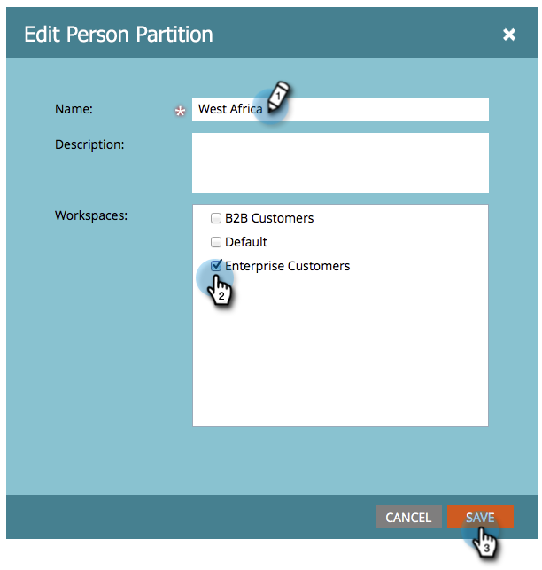

# Edición de una partición de personas existente {#edit-an-existing-person-partition}

Una partición de persona es como tener una segunda (o tercera) base de datos. Una partición se puede conectar a uno o más espacios de trabajo.

>[!NOTE]
>
>**Se requieren permisos de administrador**

>[!PREREQUISITES]
>
>[Crear una partición de persona](/help/marketo/product-docs/administration/workspaces-and-person-partitions/create-a-person-partition.md){target="_blank"}

1. Vaya al área de **[!UICONTROL Admin]**.

   

1. Haga clic en **[!UICONTROL Espacios de trabajo y particiones]**.

   

1. En la ficha **[!UICONTROL Particiones de persona]**, seleccione la partición de persona que desee editar y haga clic en **[!UICONTROL Editar partición de persona]**.

   

1. Escriba la partición de persona **[!UICONTROL Name]**, los **[!UICONTROL espacios de trabajo]** a los que pertenecen y haga clic en **[!UICONTROL Guardar]**.

   

Después de guardar los cambios, aparece la actualización.

