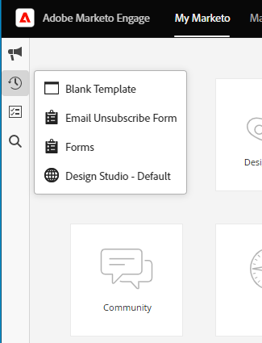

# Información general sobre la interfaz de Adobe Experience Cloud {#adobe-experience-cloud-interface-overview}

La interfaz de Adobe Experience Cloud armoniza la apariencia y la usabilidad de las aplicaciones y servicios de Adobe Experience Cloud. Pero, es más que un nuevo diseño. Es una aplicación de una sola página que ofrece la experiencia del usuario en una sola instancia.

## Flujo de usuarios {#user-flow}

Si aún no inició sesión en un producto de Adobe Experience Cloud, inicie sesión directamente en [!DNL Marketo Engage] aquí: [https://experience.adobe.com/marketo-engage](https://experience.adobe.com/marketo-engage).

Si _ya ha iniciado sesión en un producto de Adobe Experience Cloud, haga clic en el icono de menú y seleccione **[!DNL Marketo Engage]**._

>[!NOTE]
>
>El menú desplegable puede tener un aspecto diferente en función de los productos de Adobe Experience Cloud a los que esté suscrito.

## Nuevas características {#new-features}

Además de la apariencia actualizada, están disponibles las siguientes funciones:

**Centro de ayuda integrado**

Acceda a una variedad de recursos de ayuda disponibles desde la aplicación [!DNL Marketo Engage].

**Conmutador de aplicación**

Aquellos que tengan acceso a varios productos de Adobe podrán alternarlos fácilmente.

**Notificaciones y anuncios**

Vea e interactúe con notificaciones específicas de productos y anuncios generales de productos de Adobe directamente en la aplicación.

**Configuración de Adobe**

Haga clic en el icono de perfil para cambiar el idioma u otras preferencias de Adobe.

## Preguntas frecuentes {#faq}

**No puedo iniciar sesión en [!DNL Marketo Engage] mediante la interfaz de Experience Cloud. ¿Cuál podría ser el problema?**

Si puede iniciar sesión en Adobe Experience Cloud, pero luego ve el error “No se pudo cargar la página”, el problema podría estar del lado de [!DNL Marketo Engage]. Póngase en contacto con el [Soporte técnico de Marketo](https://nation.marketo.com/t5/support/ct-p/Support) para obtener ayuda.

**¿Dónde están el historial del usuario, la búsqueda global, las notificaciones de Marketo y la bandeja de tareas?**

Estas funciones se han trasladado de la barra de navegación superior a una nueva barra en la parte izquierda de la interfaz de Experience Cloud.

