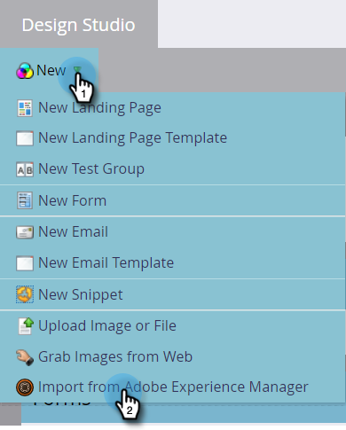
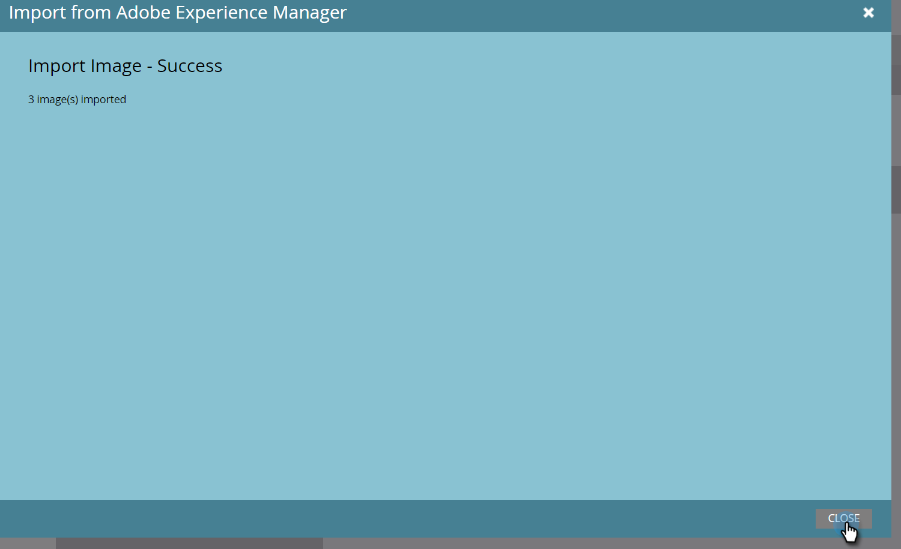

# Importación de recursos con Adobe Experience Manager {#importing-assets-with-adobe-experience-manager}

El Selector de recursos permite a los clientes de Marketo acceder, seleccionar e importar recursos de AEM en Marketo [!DNL Design Studio]. **Se requieren permisos de administrador**.

>[!AVAILABILITY]
>
>No todos han comprado esta función. Póngase en contacto con el equipo de cuenta de Adobe (su administrador de cuentas) para obtener más información.

>[!PREREQUISITES]
>
>Asegúrese de que la [configuración de AEM](/help/marketo/product-docs/core-marketo-concepts/miscellaneous/configuring-adobe-experience-manager-integration.md) ya se haya realizado.

>[!IMPORTANT]
>
>Actualmente, esta característica solo es totalmente compatible con [!DNL Firefox]. No es compatible con [!DNL Safari] y es posible que no funcione en la última versión de [!DNL Chrome], según la configuración de la cookie [!DNL SameSite].

1. Haga clic en **[!UICONTROL Design Studio]**.

   

1. Haga clic en la lista desplegable Nuevo y seleccione **[!UICONTROL Importar desde Adobe Experience Manager]**.

   

1. Elija la carpeta en la que se guardarán las imágenes.

   

1. Inicie sesión en Adobe Experience Manager (si no lo ha hecho ya).

   

1. Elija su carpeta. A continuación, seleccione las imágenes que desee haciendo clic en la miniatura (puede elegir hasta 10). Haga clic en **[!UICONTROL Seleccionar]** cuando haya terminado.

   

   >[!NOTE]
   >
   >Las imágenes no pueden tener un tamaño superior a 100 MB.

1. Haga clic en **[!UICONTROL Importar]** para completar el proceso.

   

   Haga clic en **[!UICONTROL Cerrar]** para regresar a Design Studio.

   

## Cosas que hay que tener en cuenta {#things-to-note}

* Actualmente, Marketo es compatible con las versiones 6.4 y 6.5 de Adobe Experience Manager.

* Todos los usuarios de la instancia podrán ver las imágenes que importe y acceder a ellas.

* Las imágenes no se actualizan automáticamente. Si una imagen que importó en Marketo [!DNL Design Studio] se actualiza en AEM, debe volver a importarla manualmente en Marketo.
