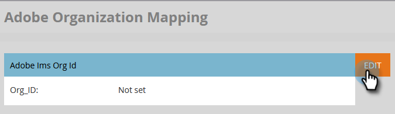

# Configuración de la asignación de organización de Adobe {#set-up-adobe-organization-mapping}

Para sincronizar con aplicaciones de Adobe, como Audience Manager, el conector de Marketo B2B CDP, [!DNL Dynamic Chat], etc., primero debe introducir las credenciales de su organización de IMS de Adobe en Marketo Engage.

>[!NOTE]
>
>* Una implementación compatible con HIPAA de una instancia de Marketo no puede utilizar esta integración.
>* Para que la integración funcione, Marketo y las demás aplicaciones de Adobe deben estar en la misma organización.

>[!IMPORTANT]
>
>Para los que se hayan incorporado a Adobe Business Platform y Identity Management System, el ID de organización asociado con la suscripción ya se rellenará y es un campo de solo lectura. Como tal, los pasos de este artículo no se aplicarían.

1. En Marketo, haga clic en **[!UICONTROL Administrador]**.

   

1. En Integración, haga clic en **[!UICONTROL Asignación de organizaciones de Adobe]**.

   

1. Haga clic en **[!UICONTROL Editar]**.

   

1. Introduzca su ID de organización de Adobe IMS (aprenda a encontrar eso [aquí](https://experienceleague.adobe.com/docs/control-panel/using/faq.html?lang=es){target="_blank"}) y haga clic en **[!UICONTROL Aceptar]**.

   

1. Haga clic en **[!UICONTROL Confirmar]**.

   

1. Haga clic en **[!UICONTROL Cerrar]**.

   

   >[!IMPORTANT]
   >
   >Por motivos de seguridad, debe ser administrador de organización de la organización de Adobe a la que desee asignar. Si no lo está, la acción fallará. Además, el usuario de Adobe y el usuario de Marketo deben utilizar la misma dirección de correo electrónico al iniciar sesión.

1. Si _no_ ha iniciado sesión, aparecerá una ventana emergente en una nueva pestaña o ventana. Inicie sesión en su organización de Adobe (esta acción valida el acceso a la organización).

Ahora puede [compartir datos de audiencia](/help/marketo/product-docs/core-marketo-concepts/smart-lists-and-static-lists/static-lists/send-a-list-to-adobe-experience-cloud.md){target="_blank"} con o [sincronizar una audiencia](/help/marketo/product-docs/adobe-experience-cloud-integrations/sync-an-audience-from-adobe-experience-cloud.md){target="_blank"} desde Adobe Experience Cloud.
