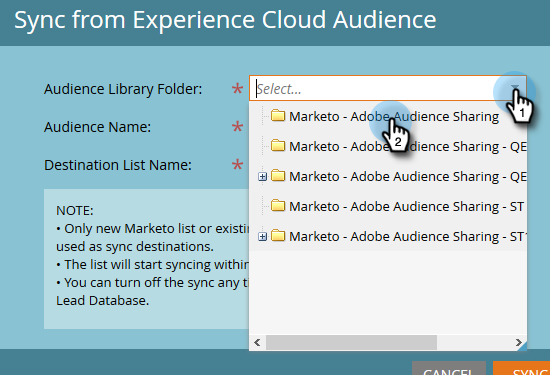

# Sincronizar una audiencia de Adobe Experience Cloud {#sync-an-audience-from-adobe-experience-cloud}

>[!NOTE]
>
>Una implementación compatible con HIPAA de una instancia de Marketo no puede utilizar esta integración.

>[!PREREQUISITES]
>
>[Configurar asignación de organización de Adobe](/help/marketo/product-docs/adobe-experience-cloud-integrations/set-up-adobe-organization-mapping.md){target="_blank"}

## Cómo sincronizar una audiencia {#how-to-sync-an-audience}

1. En Mi Marketo, haga clic en el mosaico **[!UICONTROL Base de datos]**.

   

1. Haga clic en el menú desplegable **[!UICONTROL Nuevo]** y seleccione **[!UICONTROL Sincronizar con la audiencia del Experience Cloud]**.

   

1. Haga clic en la lista desplegable **[!UICONTROL Carpeta de biblioteca de audiencias]** y seleccione la carpeta de origen que desee.

   

1. Seleccione un **[!UICONTROL nombre de audiencia]**.

   

1. Para el destino, puede seleccionar una lista existente o escribir el nombre de una nueva. En este ejemplo estamos creando uno nuevo. Haga clic en **[!UICONTROL Sincronizar]** cuando haya terminado.

   

1. Haga clic en **[!UICONTROL Aceptar]**.

   

## Preguntas frecuentes {#faq}

**¿Cómo funciona la sincronización de cookies?**

Cuando la sincronización de cookies está habilitada para su suscripción a Marketo, munchkin.js de Marketo intentará capturar y almacenar los ECID de Adobe de la organización IMS de Adobe que haya especificado durante la configuración de la integración y hacer coincidir estos ECID con el identificador de cookie de Marketo correspondiente. Esto permite que los perfiles de usuario anónimos de Marketo se enriquezcan con ECID de Adobe.

Se requiere un paso adicional para asociar el perfil de usuario anónimo a un perfil de posible cliente, que se identifica mediante un correo electrónico de texto sin formato. Aquí ](/help/marketo/product-docs/reporting/basic-reporting/report-activity/tracking-anonymous-activity-and-people.md){target="_blank"} se describe exactamente cómo funciona [.

**¿Por qué el tamaño de la lista en Marketo es diferente al de la Adobe?**

Una persona tampoco se sincronizará si no podemos vincular un ID de cookie de ECID a una persona conocida en Marketo.

**¿Es una sincronización única?**

Solo es necesario iniciar la sincronización una vez. Después, los registros se sincronizarán automáticamente. La sincronización inicial puede tardar hasta 24 horas; en adelante, los nuevos registros se sincronizarán en 2-3 horas.
