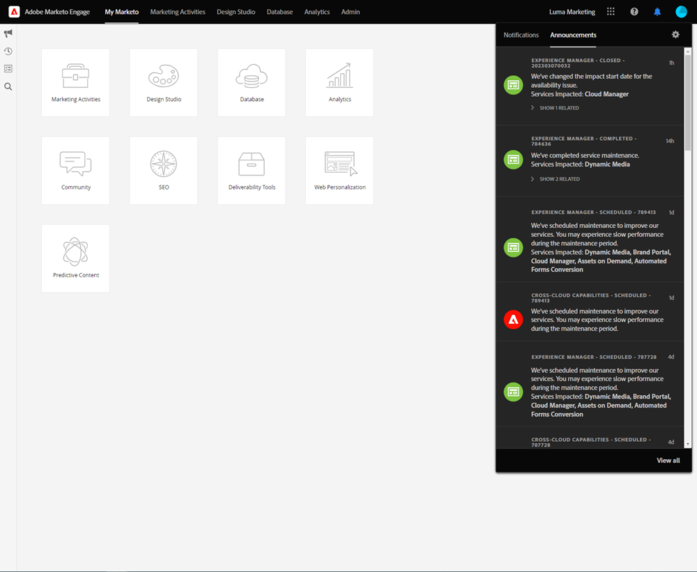

# Información general sobre Shell unificado {#unified-shell-overview}

Unified Shell alinea el aspecto &quot;shell&quot; de las aplicaciones y servicios de Adobe Experience Cloud. Pero, es más que un nuevo diseño. Es una aplicación de una sola página que ofrece experiencia de usuario en una sola instancia.

## Flujo de usuario {#user-flow}

**Flujo de shell unificado**

Si aún no ha iniciado sesión en un producto de Adobe Experience Cloud, inicie sesión directamente en [!DNL Marketo Engage] aquí: [https://experience.adobe.com/marketo-engage](https://experience.adobe.com/marketo-engage).

Si _are_ ya ha iniciado sesión en un producto de Adobe Experience Cloud, simplemente haga clic en el icono de menú y seleccione **[!DNL Marketo Engage]**.

>[!NOTE]
>
>El menú desplegable puede tener un aspecto diferente en función de los productos de Adobe Experience Cloud a los que esté suscrito.

## Nuevas funciones {#new-features}

Además del aspecto actualizado, verá las siguientes funciones:

**Centro de ayuda integrado**

Acceda a una variedad de recursos de ayuda disponibles desde la [!DNL Marketo Engage] aplicación.

**Cambio de aplicación**

Aquellos que tengan acceso a varios productos de Adobe podrán alternar fácilmente entre ellos.

**Notificaciones y anuncios**

Vea e interactúe con las notificaciones específicas del producto y los anuncios generales del producto de Adobe directamente en la aplicación.

**Configuración de Adobe**

Haga clic en el icono de perfil para cambiar el idioma u otras preferencias de todo el Adobe.

## Preguntas frecuentes {#faq}

**No puedo iniciar sesión en [!DNL Marketo Engage] a través del shell unificado. ¿Cuál podría ser el problema?**

Si puede iniciar sesión en Adobe Experience Cloud, pero luego ve el error &quot;No se pudo cargar la página&quot;, el problema podría estar en la [!DNL Marketo Engage] lado. Póngase en contacto con [Asistencia de Marketo](https://nation.marketo.com/t5/support/ct-p/Support) para obtener ayuda.

**¿Dónde están el historial de usuarios, la búsqueda global, las notificaciones de Marketo y la bandeja de tareas?**

Estas funciones se han trasladado de la barra de navegación superior a una nueva barra de la izquierda en el shell unificado.

