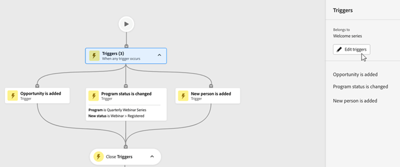
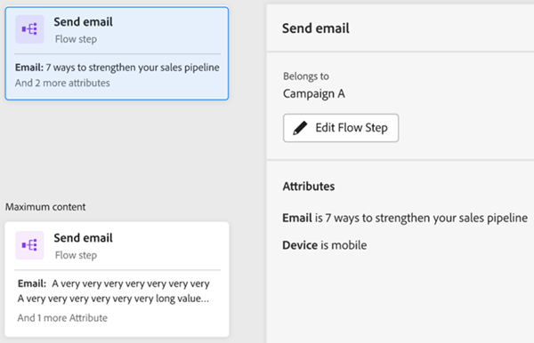
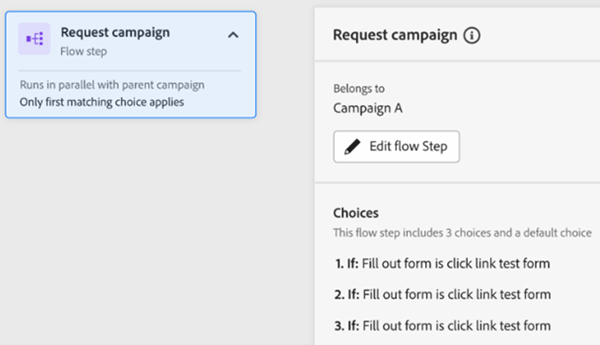
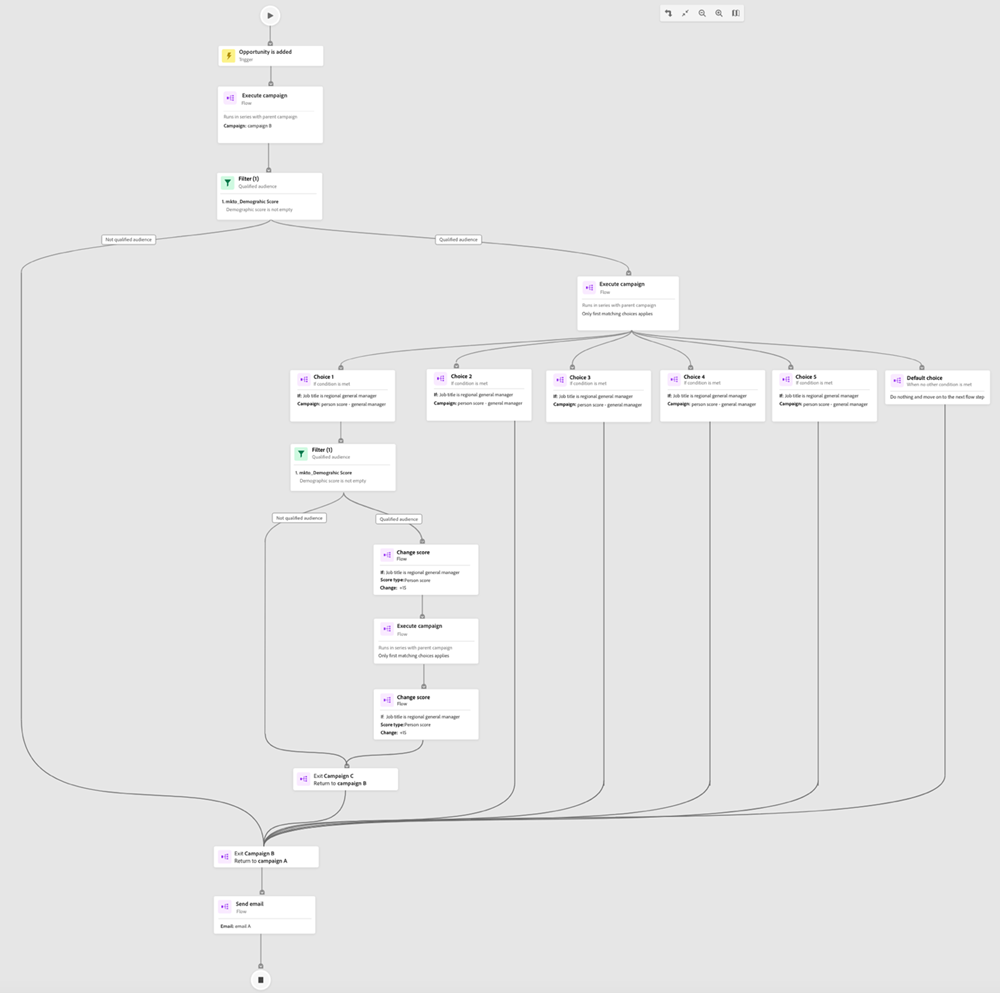

# Pestaña Mapa de participación {#engagement-map-tab}

El mapa de participación se representa mediante una serie de tarjetas de déclencheur, filtro y flujo. Al hacer clic en cada tarjeta, se muestra información adicional.

Información general sobre el déclencheur: Esta tarjeta muestra la cantidad de déclencheur en la campaña. Al hacer clic en él, se mostrará una tarjeta para cada déclencheur, así como un panel deslizable con la siguiente información:

* Campaña a la que pertenece el déclencheur
* Lista de nombres de déclencheur
* Botón &quot;Editar Déclencheur&quot;

  

Detalles del déclencheur: esta tarjeta muestra el nombre del déclencheur. Al hacer clic en él, se muestra un panel deslizable con la siguiente información:

* Campaña a la que pertenece el déclencheur
* Lista de restricciones asociadas al déclencheur
* Botón &quot;Editar Déclencheur&quot;

  

Filtro: al hacer clic en esta tarjeta, se muestra un panel deslizable con la siguiente información:

* Campaña a la que pertenece el déclencheur
* Número estimado de personas que cumplen los requisitos para el filtro
* Lista de filtros y sus restricciones respectivas
* Botón &quot;Editar filtro&quot;

  

Pasos del flujo: si un paso de flujo incluye opciones, esta tarjeta mostrará el nombre del paso del flujo. Al hacer clic en él, se muestra un panel deslizable con la siguiente información:

* Campaña a la que pertenece el paso Flujo
* Lista de condiciones de elección asociadas al paso de flujo
* Botón &quot;Editar flujo&quot;

  

Pasos de flujo: Si un paso de flujo sí lo hace _no_ Si incluye cualquier opción, esta tarjeta mostrará los atributos asociados al paso de flujo. Al hacer clic en él, se muestra un panel deslizable con la siguiente información:

* Campaña a la que pertenece el paso Flujo
* Lista de atributos asociados al paso de flujo
* Botón &quot;Editar flujo&quot;

  

## Paso de flujo para ejecutar y solicitar campañas {#flow-step-for-execute-and-request-campaigns}

* Si el paso de flujo Ejecutar o Solicitar campaña no incluye ninguna opción, la tarjeta mostrará el nombre de la campaña. Al hacer clic en la tarjeta, se muestra un panel deslizable con la siguiente información:

   * Campaña a la que pertenece el paso de flujo
   * Botón &quot;Editar flujo&quot;
   * Lista de atributos asociados al paso de flujo
   * Botón &quot;Ver lista&quot;, que abre una lista de campañas que utilizan la solicitud o ejecución de campaña específica

>[!NOTE]
>
>Puede editar los pasos de flujo desde una campaña principal. Para editar campañas anidadas, debe navegar a la campaña a través del vínculo en el panel deslizable.

* Si el paso de flujo Ejecutar o Solicitar campaña incluye opciones, la tarjeta mostrará el nombre de la campaña. Al hacer clic en la tarjeta, se muestra un panel deslizable con la siguiente información:

   * Campaña a la que pertenece el paso de flujo
   * Lista de condiciones de elección asociadas al paso de flujo
   * Botón &quot;Editar flujo&quot;

  

  

* Si una campaña de ejecución o solicitud incluye opciones, al hacer clic en la tarjeta de flujo se expandirá para mostrar todas las opciones en tarjetas individuales. Al hacer clic en la tarjeta de opción, se expandirá la campaña asociada a la opción específica, así como se mostrará un panel deslizable con la siguiente información:

   * Campaña a la que pertenece la opción
   * Botón &quot;Editar opción&quot;
   * Lista de condiciones de elección asociadas al paso de flujo
   * Botón &quot;Ver lista&quot;, que abre una lista de campañas que utilizan la solicitud o ejecución de campaña específica

  

## Visualización de una campaña de ejecución anidada {#visualizing-a-nested-execute-campaign}

VOLVIÓ A EDITAR AQUÍ-------------

Ejecute campañas ejecutadas en serie con los padres de las campañas que cumplen los requisitos para una campaña ejecutable, complete todos los pasos de flujo de la campaña y vuelva a la campaña principal para continuar con los pasos de flujo de esta campaña.

A continuación se muestra un ejemplo de campaña inteligente, &quot;Campaña A&quot;, que incluye un paso de flujo de ejecución de campaña. Piense en la &quot;Campaña A&quot; como su campaña principal.

1. Al hacer clic en la tarjeta Ejecutar flujo de campaña, se expandirá para mostrar los detalles de la &quot;Campaña B&quot;.
1. La &quot;Campaña B&quot; incluye un filtro que se ramifica en una audiencia cualificada y no cualificada.
1. La audiencia cualificada pasa por los pasos de flujo asociados a la &quot;Campaña B&quot;.
1. Toda la audiencia (cualificada y no cualificada) vuelve a la &quot;Campaña A&quot; y pasa al siguiente paso del flujo.

DEJÓ DE EDITAR AQUÍ------------------

Puede hacer clic en el paso Ejecutar flujo de campaña en &quot;Campaña B&quot;, que se expandirá para mostrar las tarjetas de opción y la campaña asociada a cada opción.

## Visualización de campañas de solicitudes {#visualizing-request-campaign}

Solicite las campañas que se ejecutan en paralelo con la campaña principal, es decir, los posibles clientes que cumplen los requisitos para una campaña de solicitud completan todos los pasos de flujo de la campaña y abandonan la campaña. Al mismo tiempo, el mismo conjunto de posibles clientes también pasará por los pasos de flujo de la campaña principal

Este es un ejemplo de campaña inteligente &quot;Campaña A&quot; que incluye un paso de flujo de campaña de solicitud. Puede considerar que la &quot;Campaña A&quot; es su campaña principal.

1. Al hacer clic en la tarjeta de flujo de campaña de solicitud, se ampliará para mostrar los detalles de la &quot;Campaña B&quot;
1. La Campaña B incluye filtros que filtran qué ramas se dirigen a una audiencia cualificada.
1. La audiencia cualificada pasa por los pasos de flujo asociados a la &quot;Campaña B&quot;
1. En paralelo, todas las audiencias se mueven a los siguientes pasos de flujo en la &quot;Campaña A&quot;

   

Puede profundizar en las campañas anidadas si alguno de los pasos del flujo incluye otra campaña de solicitud haciendo clic en la tarjeta de flujo para ver los detalles de la campaña

Este es un ejemplo de campaña de solicitudes con opciones.

## Control de errores {#error-handling}

Los errores en los pasos de lista inteligente y flujo se resaltarán mediante un icono de error en la tarjeta. Además, el mensaje de error correspondiente se reflejará en el panel deslizable.

Este es un ejemplo de error en el déclencheur que se indicará en la tarjeta de información general de déclencheur, el panel deslizable y la tarjeta de déclencheur de detalles

El error en la tarjeta de filtro puede incluir

Error en la lista inteligente que hará que no se muestre la audiencia cualificada

Error en la lógica del filtro

Error en restricciones o falta de ellas en uno o más filtros

Si no se introducen valores (atributos), no se marcarán como errores y seguirá funcionando como en la pestaña Flujo. Por lo tanto, las campañas existentes no se verán afectadas. Sin embargo, cuando los pasos de flujo no incluyen ningún atributo, estos se mostrarán como advertencias.

Nota: Los errores dentro de una campaña anidada no serán visibles hasta que haya hecho clic para expandir la campaña anidada
