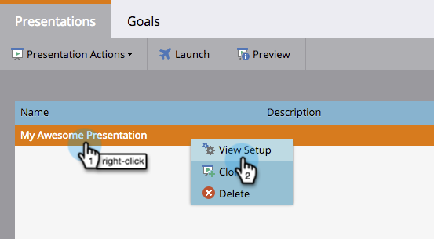
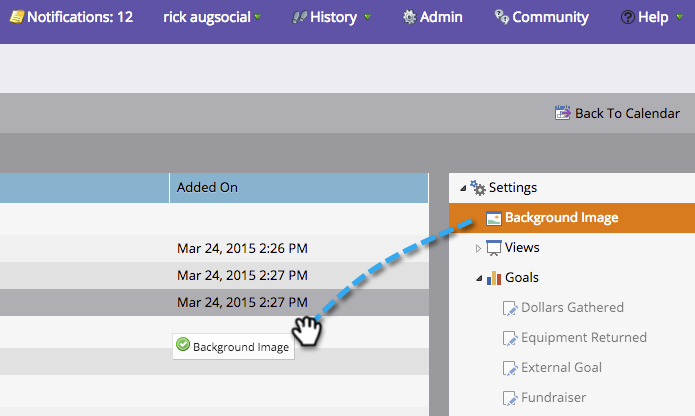

# Añadir una imagen de fondo a una presentación {#add-a-background-image-to-a-presentation}

Personalice una presentación seleccionando una imagen de fondo.

>[!PREREQUISITES]
>
>[Crear una presentación](/help/marketo/product-docs/core-marketo-concepts/marketing-calendar/calendar-hd/create-a-presentation.md)

1. Haga clic con el botón derecho en una presentación y seleccione **[!UICONTROL Ver configuración]**.

   >[!NOTE]
   >
   >También puede hacer doble clic en una presentación para entrar en la ficha de configuración.

   

1. Arrastre y suelte **[!UICONTROL Imagen de fondo]** del árbol derecho en el lienzo.

   

1. Seleccione una imagen de la biblioteca de imágenes.

   >[!TIP]
   >
   >Para obtener la apariencia más limpia, usa una imagen de **1920 x 1080** o **1280 x 720**.

   

1. Haga clic en **[!UICONTROL Vista previa]** para previsualizarla.

   

