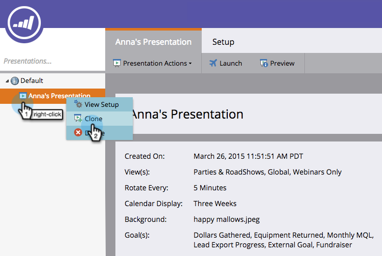

# Clonar una presentación {#clone-a-presentation}

Clonar una presentación para reutilizarla en diferentes lugares.

1. Seleccione la presentación que desea clonar.

   

1. Haga clic con el botón derecho en la presentación y seleccione **[!UICONTROL Clone]**.

   

1. Escriba un nombre para la presentación clonada y haga clic en **[!UICONTROL Clonar]**.

   

   ¡Excelente! Ya existe una copia exacta de la presentación.
