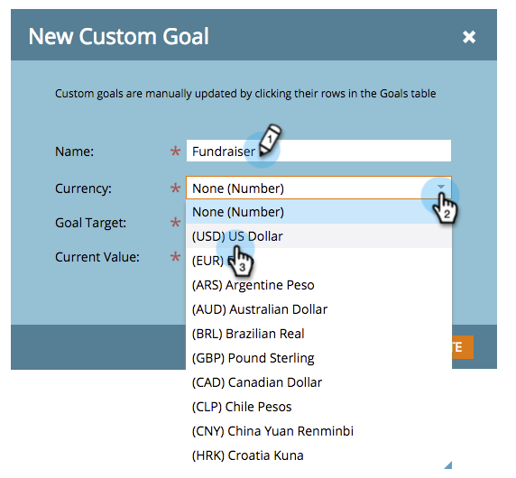

# Crear un objetivo personalizado {#create-a-custom-goal}

Los objetivos son formas de seguir el progreso y motivar a su equipo. Una vez creadas, deben actualizarse manualmente.

Como las presentaciones, los objetivos son [workspace](/help/marketo/product-docs/administration/workspaces-and-person-partitions/understanding-workspaces-and-person-partitions.md)específico de

1. Vaya a la **Calendario**.

   

1. Haga clic en **Presentación** en la esquina inferior derecha.

   

1. Seleccione el **Objetivos** pestaña .

   

1. Arrastrar y soltar **Objetivo personalizado** en el lienzo.

   

1. Escriba un nombre para el objetivo. Seleccione un **Moneda**.

   >[!NOTE]
   >
   >Si el objetivo no es un valor monetario, puede seleccionar **Ninguna**.

   

1. Introduzca un valor para la variable **Objetivo objetivo** y **Valor actual** (si no hay uno, **enter 0**). A continuación, haga clic en **Crear**.

   

   ¡Se ha creado su objetivo personalizado!

   
