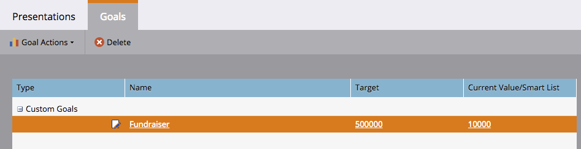

# Crear un objetivo personalizado {#create-a-custom-goal}

Los objetivos son formas de seguir el progreso y motivar a su equipo. Una vez creadas, deben actualizarse manualmente.

Al igual que las presentaciones, los objetivos son específicos del [espacio](../../../../product-docs/administration/workspaces-and-person-partitions/understanding-workspaces-and-person-partitions.md)de trabajo.

1. Vaya al **calendario**.

   

1. Haga clic en **Presentación** en la esquina inferior derecha.

   

1. Seleccione la ficha** Objetivos**.

   

1. Arrastre y suelte el objetivo **personalizado** en el lienzo.

   

1. Escriba un nombre para el objetivo. Seleccione una **moneda**.

   >[!NOTE]
   >
   >Si el objetivo no es un valor monetario, puede seleccionar **Ninguno**.

   

1. Introduzca un valor para el Destinatario **de** objetivo y el valor **** actual (si no hay ninguno, **introduzca 0**). A continuación, haga clic en **Crear**.

   

   Se ha creado su objetivo personalizado.

   

