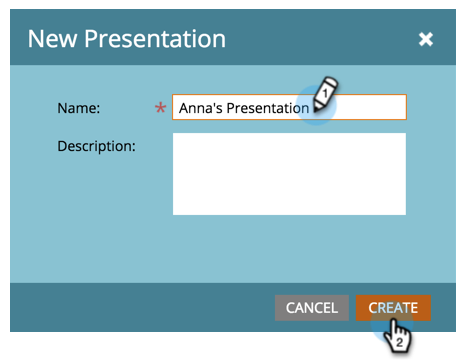

# Crear una presentación {#create-a-presentation}

Cree una presentación para proyectar las vistas y los objetivos del calendario de su equipo en un HDTV. Presentations son específicos de Workspace.

>[!NOTE]
>
>**Disponibilidad**
>
>No todos los clientes han adquirido esta funcionalidad. Póngase en contacto con su representante de ventas para obtener más detalles.

1. Vaya al** Calendario**.

   

1. Haga clic en **Presentación** en la esquina inferior derecha.

   

1. Haga clic en Acciones **de** presentación y seleccione **Nueva presentación**.

   

1. Elija un nombre para la presentación. Haga clic en **Crear**.

   

   ¡Buen trabajo! Ya está listo para personalizar la presentación.

>[!NOTE]
>
>**Artículos relacionados**
>
>* [Personalización de una presentación](customize-a-presentation.md)

>

