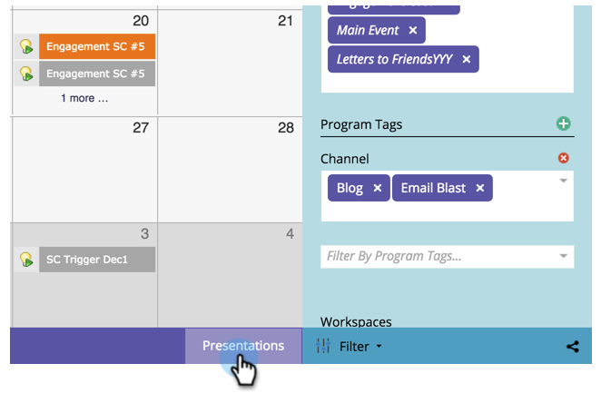
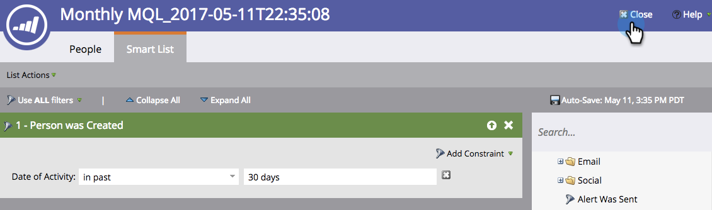

# Crear un objetivo de lista inteligente {#create-a-smart-list-goal}

Los objetivos son formas de seguir el progreso y motivar a su equipo. Se pueden combinar con listas inteligentes para rastrear todo tipo de cosas en Marketo. Además, después de configurar un objetivo de lista inteligente, se actualizará automáticamente cada 2 horas cuando se utilice en una presentación.

Como las presentaciones, los objetivos son [workspace](/help/marketo/product-docs/administration/workspaces-and-person-partitions/understanding-workspaces-and-person-partitions.md)específico de

1. Vaya a la **Calendario**.

   

1. Haga clic en **Presentación** en la esquina inferior derecha.

   

1. Seleccione el **Objetivos** pestaña .

   

1. Arrastrar y soltar **Objetivo de lista inteligente** en el lienzo.

   

1. Introduzca un nombre para el objetivo e introduzca un **Objetivo objetivo**. A continuación, haga clic en **Crear**.

   

1. [Definición de la lista inteligente](/help/marketo/product-docs/core-marketo-concepts/smart-lists-and-static-lists/creating-a-smart-list/find-and-add-filters-to-a-smart-list.md). ¡Las posibilidades son infinitas!

   

1. Una vez establecida la lista inteligente, haga clic en el botón **Cerrar** y vuelva a la pestaña anterior.

   

   ¡Mira eso! Se ha creado el objetivo de la lista inteligente.

   
