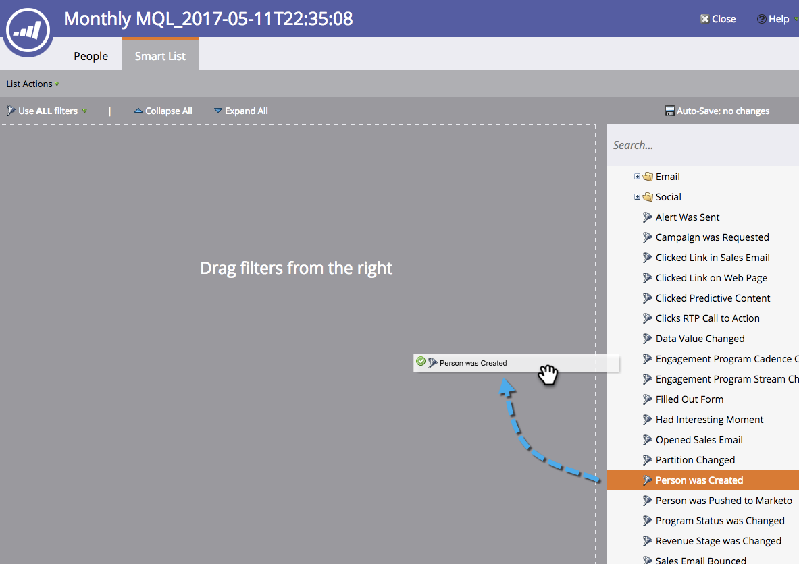

# Creación de una meta de lista inteligente {#create-a-smart-list-goal}

Los objetivos son formas de seguir el progreso y motivar a su equipo. Se pueden combinar con listas inteligentes para rastrear todo tipo de cosas en Marketo. Además, una vez que haya establecido un objetivo de lista inteligente, se actualizará automáticamente cada dos horas cuando se utilice en una presentación.

Al igual que las presentaciones, los objetivos son específicos de [workspace](/help/marketo/product-docs/administration/workspaces-and-person-partitions/understanding-workspaces-and-person-partitions.md).

1. Ir a **[!UICONTROL Calendario]**.

   

1. Haga clic en **[!UICONTROL Presentaciones]** en la esquina inferior derecha.

   

1. Seleccione la ficha **[!UICONTROL Metas]**.

   

1. Arrastre y suelte **[!UICONTROL Smart List Goal]** en el lienzo.

   

1. Escriba un nombre para la meta e ingrese una **[!UICONTROL Meta]**. Luego haga clic en **[!UICONTROL Crear]**.

   

1. [Defina la lista inteligente](/help/marketo/product-docs/core-marketo-concepts/smart-lists-and-static-lists/creating-a-smart-list/find-and-add-filters-to-a-smart-list.md). ¡Las posibilidades son infinitas!

   

1. Una vez establecida la lista inteligente, haga clic en el botón **[!UICONTROL Cerrar]** y vuelva a la ficha anterior.

   

   ¡Mira eso! Se ha creado su objetivo de lista inteligente.

   
