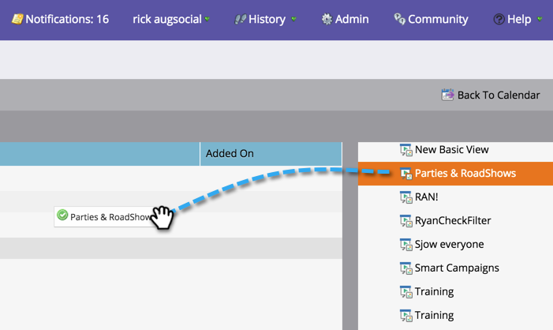
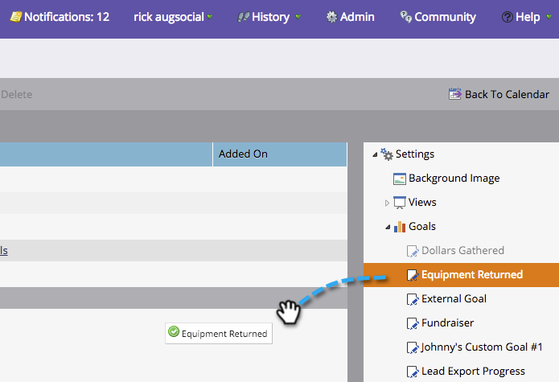
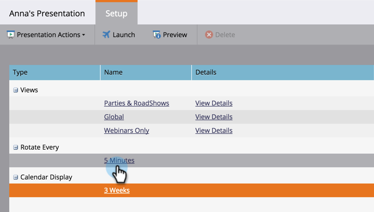
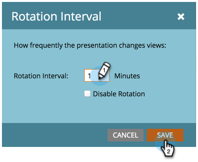
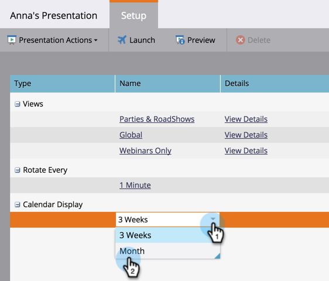
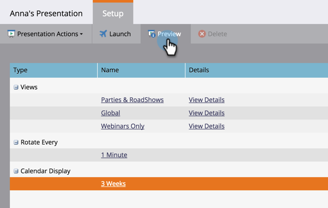
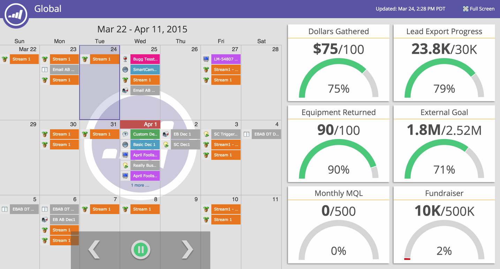

# Personalizar una presentación {#customize-a-presentation}

Configure la presentación del calendario para que refleje los objetivos y las actividades que más importan a su equipo.

>[!AVAILABILITY]
>
>
>No todos los usuarios de Marketo Engage han adquirido esta funcionalidad. Póngase en contacto con el equipo de cuenta de Adobe (su administrador de cuentas) para obtener más información.

>[!PREREQUISITES]
>
>* [Crear metas personalizadas](/help/marketo/product-docs/core-marketo-concepts/marketing-calendar/calendar-hd/create-a-custom-goal.md){target="_blank"} o [metas de listas inteligentes](/help/marketo/product-docs/core-marketo-concepts/marketing-calendar/calendar-hd/create-a-smart-list-goal.md){target="_blank"}
>
>* [Crear una presentación](/help/marketo/product-docs/core-marketo-concepts/marketing-calendar/calendar-hd/create-a-presentation.md){target="_blank"}

## Elección de las vistas {#choosing-the-views}

Las presentaciones pasan por diferentes [definiciones de filtros](/help/marketo/product-docs/core-marketo-concepts/marketing-calendar/working-with-the-calendar/filtering-the-marketing-calendar.md){target="_blank"} que elija. Extraiga tantas vistas como desee y personalice la frecuencia.

1. En el árbol derecho, arrastre las distintas vistas por las que desee girar la presentación.

   

## Agregar una meta {#add-a-goal}

Las presentaciones son más eficaces cuando muestran los objetivos del equipo. Arrastre sobre diferentes [metas personalizadas](/help/marketo/product-docs/core-marketo-concepts/marketing-calendar/calendar-hd/create-a-custom-goal.md){target="_blank"} o [metas de lista inteligente](/help/marketo/product-docs/core-marketo-concepts/marketing-calendar/calendar-hd/create-a-smart-list-goal.md){target="_blank"}. Se pueden usar hasta 10.

1. En el árbol derecho, arrastre los diferentes objetivos que desee mostrar en la presentación.

   

## Establecer la frecuencia de rotación {#set-the-frequency-of-rotation}

Una vez extraídas las vistas, defina la frecuencia con la que gira entre las distintas vistas.

1. Haga clic en **[!UICONTROL 5 minutos]** (esta es la cadencia predeterminada).

   

1. Escriba una hora en minutos. Haga clic en **[!UICONTROL Guardar]**.

   >[!NOTE]
   >
   >Mostrar una vista estática marcando **[!UICONTROL Deshabilitar rotación]**.

   

## Definir la visualización del calendario {#set-the-calendar-display}

La visualización del calendario se puede cambiar a una vista de 3 semanas o mensual.

1. Seleccione la lista desplegable **[!UICONTROL Visualización del calendario]** y elija entre **[!UICONTROL 3 semanas]** o un **[!UICONTROL Mes]**.

   

>[!TIP]
>
>Establezca una [imagen de fondo](/help/marketo/product-docs/core-marketo-concepts/marketing-calendar/calendar-hd/add-a-background-image-to-a-presentation.md){target="_blank"} para su presentación.

## Previsualizar una presentación {#preview-a-presentation}

Una vez configurada la presentación, está lista para previsualizarse e iniciarse.

1. Seleccionar **[!UICONTROL vista previa]**.

   

   Este es el aspecto de la presentación.

   

   Para ajustar la vista, utilice definiciones de filtro diferentes.

>[!MORELIKETHIS]
>
>* [Agregar una imagen de fondo a una presentación](/help/marketo/product-docs/core-marketo-concepts/marketing-calendar/calendar-hd/add-a-background-image-to-a-presentation.md){target="_blank"}
>* [Iniciar una presentación](/help/marketo/product-docs/core-marketo-concepts/marketing-calendar/calendar-hd/launch-a-presentation.md){target="_blank"}
