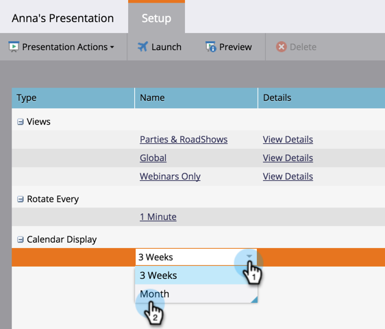

# Personalizar una presentación {#customize-a-presentation}

Configure la presentación del calendario para que refleje los objetivos y las actividades que más le importan a su equipo.

>[!AVAILABILITY]
>
>
>No todos los clientes han adquirido esta funcionalidad. Póngase en contacto con su representante de ventas para obtener más información.

>[!PREREQUISITES]
>
>* [Crear objetivos personalizados ](/help/marketo/product-docs/core-marketo-concepts/marketing-calendar/calendar-hd/create-a-custom-goal.md) o  [objetivos de listas inteligentes](/help/marketo/product-docs/core-marketo-concepts/marketing-calendar/calendar-hd/create-a-smart-list-goal.md)
   >
   >
* [Crear una presentación](/help/marketo/product-docs/core-marketo-concepts/marketing-calendar/calendar-hd/create-a-presentation.md)

## Selección de las vistas {#choosing-the-views}

Presentations recorre diferentes [definiciones de filtro](/help/marketo/product-docs/core-marketo-concepts/marketing-calendar/working-with-the-calendar/filtering-the-marketing-calendar.md) que elija. Extraiga tantas vistas como desee y personalice la frecuencia.

1. En el árbol de la derecha, arrastre las diferentes vistas por las que desee rotar en la presentación.

   

## Agregar un objetivo {#add-a-goal}

Presentations es el más impresionante cuando muestra los objetivos de su equipo. Simplemente arrastre los [objetivos personalizados](/help/marketo/product-docs/core-marketo-concepts/marketing-calendar/calendar-hd/create-a-custom-goal.md) o [objetivos de lista inteligente](/help/marketo/product-docs/core-marketo-concepts/marketing-calendar/calendar-hd/create-a-smart-list-goal.md) diferentes. Puede usar hasta 10.

1. En el árbol de la derecha, arrastre los diferentes objetivos que desee mostrar en la presentación.

   

## Establezca la frecuencia de rotación {#set-the-frequency-of-rotation}

Una vez que haya obtenido las vistas que desee en la presentación, defina la frecuencia con la que rota entre las diferentes vistas.

1. Haga clic en **5 minutos** (esta es la cadencia predeterminada).

   

1. Introduzca una hora en minutos. Haga clic en **Guardar**.

   >[!NOTE]
   >
   >Para mostrar una vista estática, marque **Deshabilitar rotación**.

   

## Configuración de la visualización del calendario {#set-the-calendar-display}

La visualización del calendario se puede cambiar a una vista mensual o de tres semanas.

1. Seleccione la lista desplegable **Visualización del calendario** y elija entre **3 semanas** o un **Mes**.

   

   ¡Increíble! ¿Listo para ver su presentación?

>[!TIP]
>
>Establezca una [imagen de fondo](/help/marketo/product-docs/core-marketo-concepts/marketing-calendar/calendar-hd/add-a-background-image-to-a-presentation.md) para la presentación. Sugerimos gatitos o arcos de lluvia.

## Vista previa de una presentación {#preview-a-presentation}

Una vez configurada la presentación, está lista para su vista previa e inicio.

1. Seleccione **Preview**.

   

   ¡Ta-da! Este es el aspecto que podría tener la presentación.

   

   ¿No te gusta lo que ves? Vuelva y utilice distintas definiciones de filtro para crear la vista que desee.

>[!MORELIKETHIS]
>
>* [Agregar una imagen de fondo a una presentación](/help/marketo/product-docs/core-marketo-concepts/marketing-calendar/calendar-hd/add-a-background-image-to-a-presentation.md)
>* [Iniciar una presentación](/help/marketo/product-docs/core-marketo-concepts/marketing-calendar/calendar-hd/launch-a-presentation.md)

