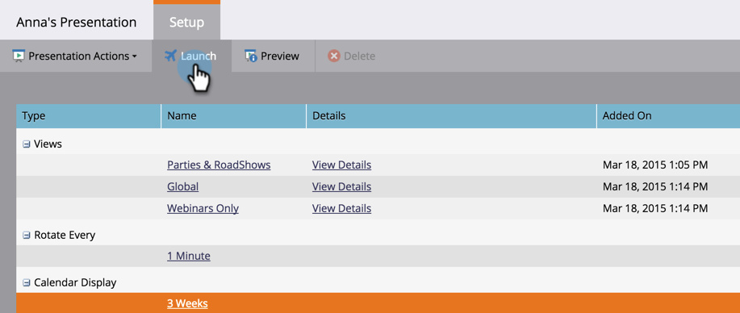

# Iniciar una presentación {#launch-a-presentation}

Una vez que haya establecido las vistas y la frecuencia de rotación para su presentación, es hora de que se apague.

>[!AVAILABILITY]
>
>
>No todos los clientes han adquirido esta funcionalidad. Póngase en contacto con su representante de ventas para obtener más información.

>[!PREREQUISITES]
>
>* [Crear una presentación](/help/marketo/product-docs/core-marketo-concepts/marketing-calendar/calendar-hd/create-a-presentation.md)
>* [Personalizar una presentación](/help/marketo/product-docs/core-marketo-concepts/marketing-calendar/calendar-hd/customize-a-presentation.md)

>[!TIP]
>
>Asegúrese de **Vista previa de una presentación** antes de comenzar.

1. Haga clic en **Launch**.

   

1. Haga clic en **Launch** una vez más. Esto lo cerrará de Marketo para que la presentación se pueda mostrar de forma segura.

   

   >[!TIP]
   >
   >La presentación se iniciará en una nueva pestaña. Si es necesario, mueva la pestaña a un monitor externo o TV para que se muestre y haga clic en **Pantalla completa** (o presione **F11** en el teclado si está utilizando Internet Explorer).
