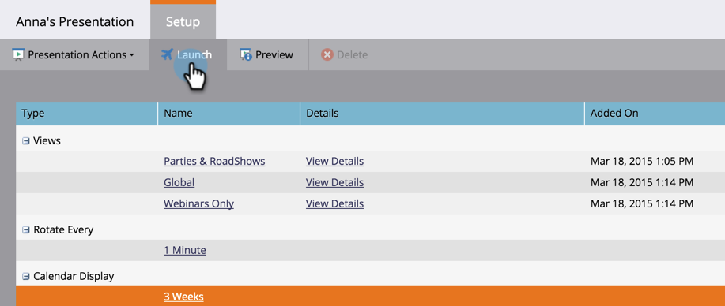

# Iniciar una presentación {#launch-a-presentation}

Una vez establecidas las vistas y la frecuencia de rotación, la presentación está lista para iniciarse.

>[!AVAILABILITY]
>
>
>No todos los usuarios de Marketo Engage han adquirido esta funcionalidad. Póngase en contacto con el equipo de cuenta de Adobe (su administrador de cuentas) para obtener más información.

>[!PREREQUISITES]
>
>* [Crear una presentación](/help/marketo/product-docs/core-marketo-concepts/marketing-calendar/calendar-hd/create-a-presentation.md)
>* [Personalizar una presentación](/help/marketo/product-docs/core-marketo-concepts/marketing-calendar/calendar-hd/customize-a-presentation.md)

>[!TIP]
>
>Previsualice la presentación antes de iniciarla.

1. Haga clic en **[!UICONTROL Iniciar]**.

   

1. Haga clic en **[!UICONTROL Iniciar]** una vez más. Esto cerrará la sesión de Marketo para que la presentación se pueda mostrar de forma segura.

   

   >[!TIP]
   >
   >La presentación se iniciará en una nueva ficha. Si es necesario, mueva la ficha a un monitor externo para que la muestre y haga clic en **[!UICONTROL Pantalla completa]**.
