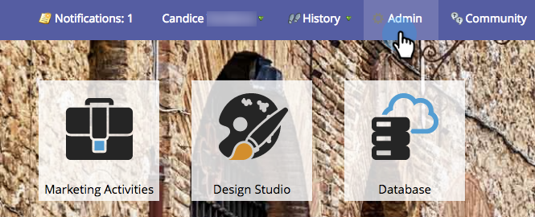
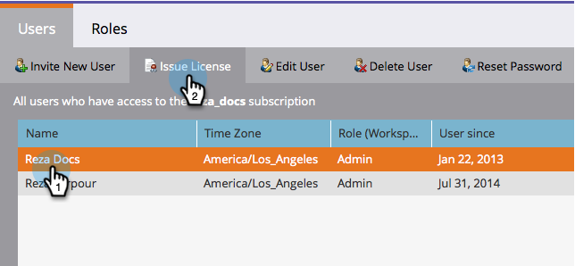

# Emitir o revocar una licencia de calendario de marketing {#issue-revoke-a-marketing-calendar-license}

>[!NOTE]
>
>**Se requieren permisos de administrador**

Para utilizar los puestos de [Calendario de mercadotecnia](/help/marketo/product-docs/core-marketo-concepts/marketing-calendar/understanding-the-calendar/navigating-the-marketing-calendar.md){target="_blank"}, debe otorgar licencias a los usuarios que necesiten acceso.

1. Vaya a la sección **[!UICONTROL Admin]**.

   

1. Haga clic en **[!UICONTROL Usuarios y funciones]**.

   

1. Seleccione los usuarios y haga clic en **[!UICONTROL Licencia de emisión]**.

   >[!TIP]
   >
   >Use **Ctrl/Cmd+clic** para seleccionar varios usuarios de una sola vez.

   

1. Marque **[!UICONTROL Habilitar licencia]** y haga clic en **[!UICONTROL Guardar]**.

   >[!NOTE]
   >
   >Hay un límite de 5 licencias. Si necesita más, póngase en contacto con su representante de ventas.

   

   La marca de verificación verde debería aparecer ahora en &#39;[!UICONTROL Calendario]&#39;.

   
