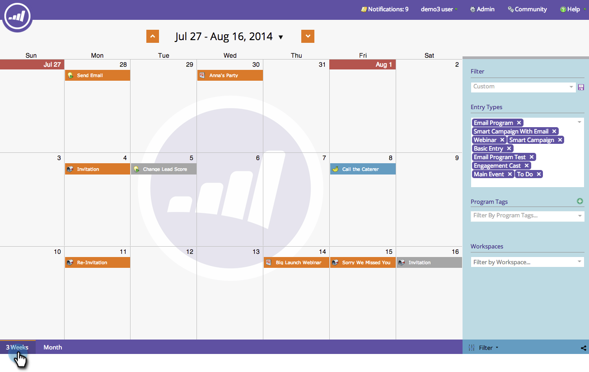

# Navegación por el calendario de marketing {#navigating-the-marketing-calendar}

Obtenga información sobre cómo navegar por el calendario de marketing.

>[!PREREQUISITES]
>
>Asegúrese de que tiene una [licencia del calendario de mercadotecnia](/help/marketo/product-docs/core-marketo-concepts/marketing-calendar/understanding-the-calendar/issue-revoke-a-marketing-calendar-license.md){target="_blank"}; de lo contrario, el mosaico del calendario de mercadotecnia no aparecerá en Mi Marketo.

>[!NOTE]
>
>Las campañas inteligentes recurrentes no son compatibles con los calendarios de marketing.

1. Vaya a **Calendario de mercadotecnia**.

   

1. Esta es una vista general de los recursos programados en la instancia de Marketo.

   

## Cambiar entre modos {#change-between-modes}

1. Haga clic en las fichas **[!UICONTROL 3 semanas]** o **[!UICONTROL Mes]** para cambiar de modo.

   

## Uso de la vista de agenda {#use-the-agenda-view}

La vista de agenda muestra todas las entradas como una lista.

1. Haga clic en la lista desplegable **[!UICONTROL Filtro]**.

   

1. Seleccione la vista **[!UICONTROL Agenda]**.

   

   Esta vista muestra todo lo que se ha planificado.

   

## Navegar por el tiempo {#navigate-through-time}

Haga clic en los botones de navegación.

También puede utilizar estos métodos abreviados del teclado.

| Acción | Método abreviado de teclado |
|---|---|
| En el tiempo | alt/opt + up |
| Avanzar en el tiempo | alt/opt + down |
| Ir a &quot;hoy&quot; | alt/opt + t |

Estos son los conceptos básicos. También puede personalizar la vista mediante filtros.

>[!MORELIKETHIS]
>
>[Filtrado del calendario de marketing](/help/marketo/product-docs/core-marketo-concepts/marketing-calendar/working-with-the-calendar/filtering-the-marketing-calendar.md){target="_blank"}
