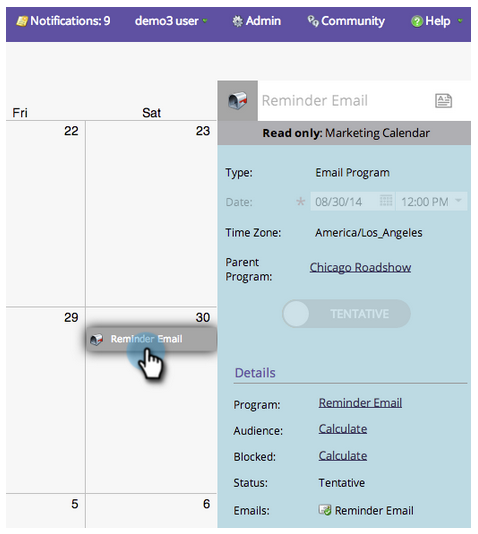
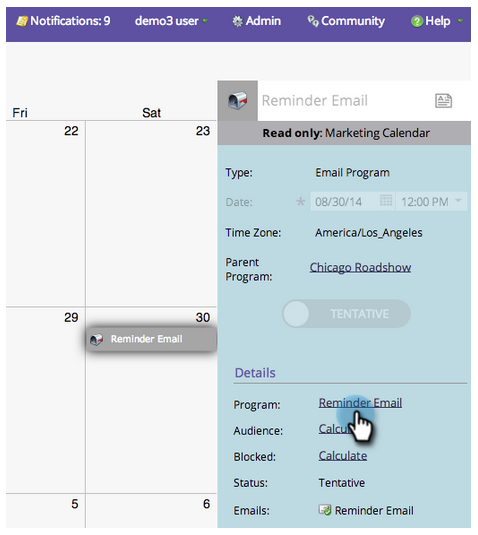

# Ver detalles de la entrada {#view-entry-details}

1. Seleccione una entrada del calendario.

   

1. Las entradas son de solo lectura en el Calendario de marketing. Vaya al programa para realizar modificaciones.

   

>[!TIP]
>
>Haga clic con el botón derecho en el panel de detalles para acceder a los menús de navegación o abrir los editores.
