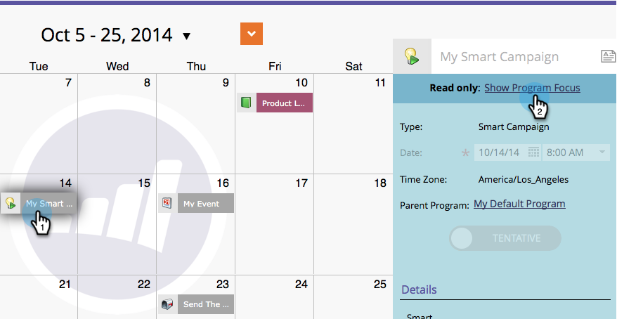

# Confirmar entradas directamente en el calendario de marketing {#confirm-entries-directly-in-the-marketing-calendar}

Las campañas inteligentes y los programas de correo electrónico se pueden crear como entradas provisionales y deben confirmarse para que cualquier cosa suceda. Así es cómo se hace.

1. Ir a **[!UICONTROL Calendario]**.

   

1. Seleccione la entrada que desea confirmar y haga clic en **[!UICONTROL Mostrar enfoque del programa]**.

   

1. Continúe y confirme la entrada.

   

   La confirmación ejecuta una serie de procesos de validación y, si todo se cierra, la entrada se confirma.

   
