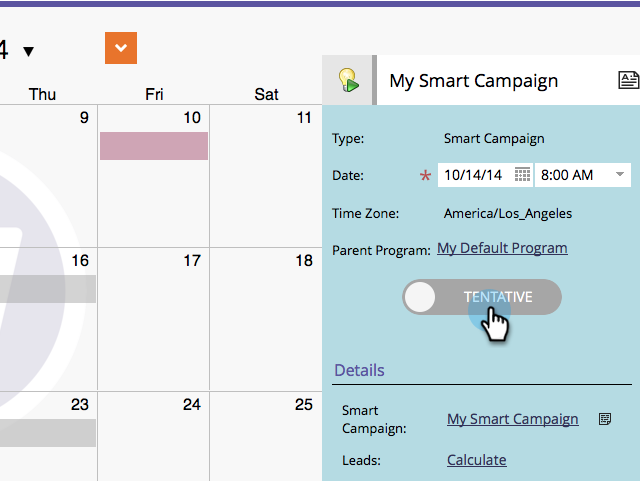

# Confirmar entradas directamente en el calendario de mercadotecnia {#confirm-entries-directly-in-the-marketing-calendar}

Las campañas inteligentes y los programas de correo electrónico pueden crearse como entradas tentativas y deben confirmarse para que cualquier cosa pueda suceder realmente. Así es como.

1. Vaya al **Calendario**.

   

1. Seleccione la entrada que desee confirmar y haga clic en **Mostrar enfoque de Programa**.

   

1. Adelante y confirme la entrada.

   

   La confirmación ejecuta una serie de procesos de validación y si todo se cierra, la entrada se confirmará.

   

