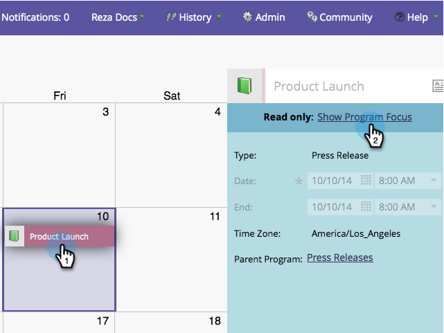

# Crear entradas directamente en el calendario de marketing {#create-entries-directly-in-the-marketing-calendar}

Marketo permite crear entradas directamente en el calendario de marketing mediante el modo de enfoque del programa. Puede crear los siguientes tipos de entradas:

* Entradas básicas
* Entradas personalizadas
* Programas de correo electrónico
* Campañas inteligentes

1. Haga clic en el mosaico **[!UICONTROL Calendario]**.

   

1. Seleccione una entrada anterior y haga clic en **[!UICONTROL Mostrar enfoque del programa]**.

   

1. Una vez en el modo de enfoque del programa, seleccione el día de su elección para añadir una entrada.

   

1. Asigne un nombre a la entrada y seleccione un tipo.

   

   >[!TIP]
   >
   >Tenga en cuenta que también puede crear **Campañas inteligentes**, **Programas de correo electrónico** y **Entradas básicas** de la misma manera.

1. Cuando termine de editar, cierre el modo de enfoque del programa.

   

>[!MORELIKETHIS]
>
>[Editar entradas directamente en el calendario de mercadotecnia](/help/marketo/product-docs/core-marketo-concepts/marketing-calendar/working-with-the-calendar/edit-entries-directly-in-the-marketing-calendar.md){target="_blank"}
