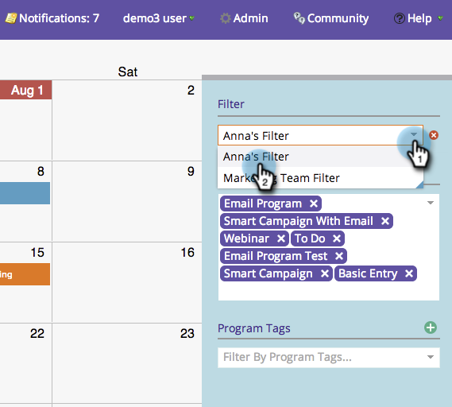

# Eliminación de un filtro en el calendario de mercadotecnia {#deleting-a-filter-in-the-marketing-calendar}

Si desea eliminar un filtro en el calendario de marketing, ha llegado al lugar correcto.

1. Seleccione el filtro que desee eliminar.

   

1. Haga clic en el color rojo **x**.

   

1. Haga clic en **Eliminar** para confirmar.

   
