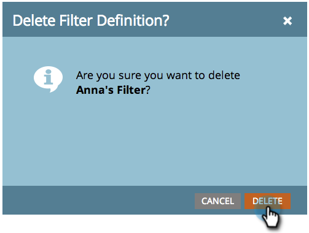

# Eliminación de un filtro en el calendario de marketing {#deleting-a-filter-in-the-marketing-calendar}

Si desea eliminar un filtro en el Calendario de marketing, ha llegado al lugar correcto.

1. Seleccione el filtro que desee eliminar.

   

1. Haga clic en el **x** rojo.

   

1. Haga clic en **[!UICONTROL Eliminar]** para confirmar.

   
