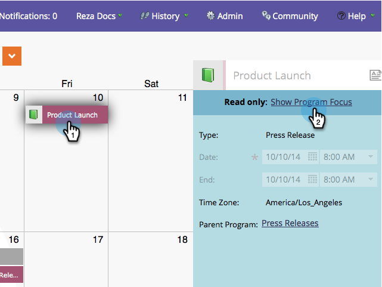

# Editar entradas directamente en el calendario de marketing {#edit-entries-directly-in-the-marketing-calendar}

Una vez en el modo de enfoque del programa, puede realizar rápidamente cambios en las entradas del calendario. Así es como.

## Activar enfoque del programa {#enable-program-focus}

1. Haga clic en el mosaico **[!UICONTROL Calendario]**.

   

1. Seleccione una entrada que pertenezca al programa en el que desea centrarse y haga clic en **[!UICONTROL Mostrar enfoque del programa]**.

   

## Reprogramar entrada {#reschedule-entry}

1. Basta con arrastrar y soltar una entrada para volver a programarla.

   

## Editar nombre de entrada {#edit-entry-name}

1. Seleccione la entrada cuyo nombre desea cambiar.

   

1. Edite el nombre de la entrada.

   

   >[!TIP]
   >
   >También puede editar la descripción.
   >
   >

## Convertir tipo de entrada {#convert-entry-type}

Después de escribir rápidamente las entradas básicas, puede convertirlas en su forma final.

1. Busque y seleccione la entrada básica que desea convertir y cambie su tipo.

   

## Editar detalles de entrada {#edit-entry-details}

Puede obtener acceso rápidamente a diferentes áreas de las entradas para editarlas.

1. Haga clic con el botón derecho en una entrada y seleccione el área que desee editar.

   

¡Eso es todo! Como puede ver, puede hacer muchas cosas directamente desde el Calendario de marketing.

>[!MORELIKETHIS]
>
>[Eliminar entradas directamente en el calendario de marketing](/help/marketo/product-docs/core-marketo-concepts/marketing-calendar/working-with-the-calendar/delete-entries-directly-in-the-marketing-calendar.md){target="_blank"}
