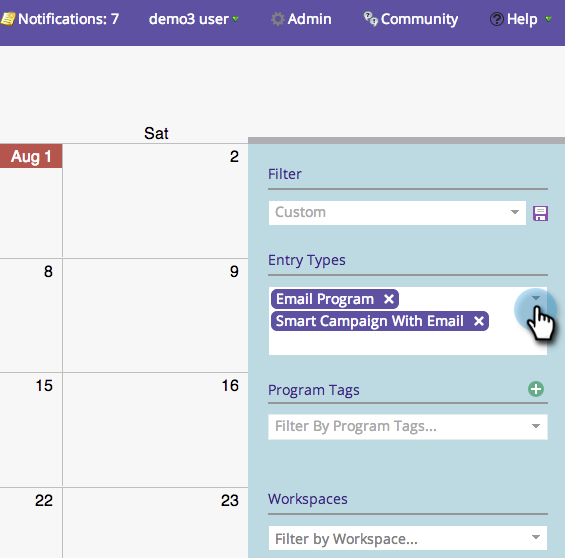

# Filtrado del calendario de marketing {#filtering-the-marketing-calendar}

Utilice tipos de entrada, etiquetas de programa o espacios de trabajo para filtrar la información mostrada en el calendario.

1. Vaya al Calendario.

1. Haga clic en el **Tipo de entrada** lista desplegable.

   >[!NOTE]
   >
   >Los tipos de entrada predeterminados serán **Correo electrónico** **Programas** y **Smart** **Campañas** **con** **Correo electrónico**.

   

1. Elija tipos de entrada adicionales que desee ver en el filtro.

   

   >[!TIP]
   >
   >Para obtener descripciones de los tipos de entrada estándar, consulte [Programación del programa Vista Tipos de entradas](/help/marketo/product-docs/core-marketo-concepts/programs/program-schedule-view/program-schedule-view-entry-types.md).

1. Seleccione las etiquetas de programa que le interesen.

   

1. Seleccione el valor de la etiqueta.

   

   ¡Increíble! Ahora solo verá entradas que se apliquen al filtro que acaba de definir.

   >[!NOTE]
   >
   >[Guardar una definición de filtro en el calendario de marketing](/help/marketo/product-docs/core-marketo-concepts/marketing-calendar/working-with-the-calendar/saving-a-filter-definition-in-the-marketing-calendar.md)
