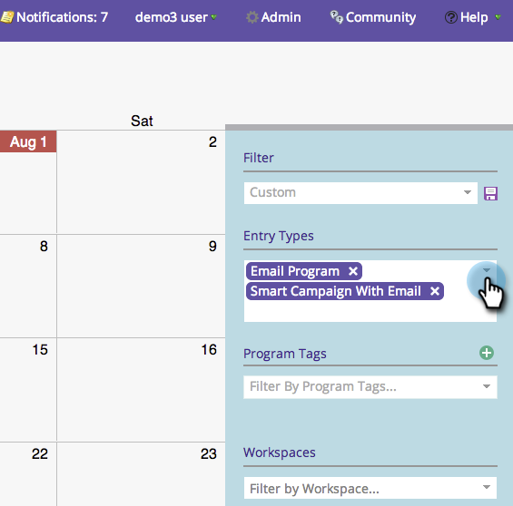

# Filtrado del calendario de marketing {#filtering-the-marketing-calendar}

Utilice tipos de entrada, etiquetas de programa o espacios de trabajo para filtrar la información mostrada en el calendario.

1. Haga clic en el mosaico **[!UICONTROL Calendario]**.

1. Haga clic en la lista desplegable **[!UICONTROL Tipo de entrada]**.

   >[!NOTE]
   >
   >Los tipos de entrada predeterminados serán **[!UICONTROL Correo electrónico]** **[!UICONTROL Programas]** y **[!UICONTROL Campañas inteligentes con correo electrónico]**.

   

1. Elija tipos de entradas adicionales para añadir al filtro.

   

   >[!TIP]
   >
   >Para obtener descripciones de los tipos de entrada estándar, consulte [Tipos de entrada de vista de programación del programa](/help/marketo/product-docs/core-marketo-concepts/programs/program-schedule-view/program-schedule-view-entry-types.md){target="_blank"}.

1. Seleccione las etiquetas de programa que le interesen.

   

1. Seleccione el valor de la etiqueta.

   

   Ahora solo serán visibles las entradas que coincidan con el filtro definido.

   >[!NOTE]
   >
   >[Guardando definición de filtro en el calendario de mercadotecnia](/help/marketo/product-docs/core-marketo-concepts/marketing-calendar/working-with-the-calendar/saving-a-filter-definition-in-the-marketing-calendar.md){target="_blank"}
